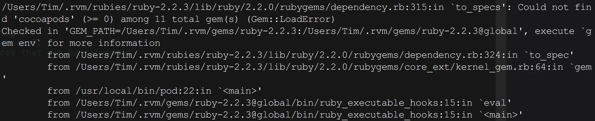

# 常见问题使用中问题

## cocoaPods相关

执行`pod install`中出现如下问题
安装好cocoapods之后使用命令pod install的时候显示出来的，原因是我安装命令是`sudo gem install cocoapods`

原先是安装cocoapods时采用的sudo，所有出现问题，
解决：
先卸载，重新安装
`sudo gem uninstall cocoapods`
`gem install cocoapods`

`pod install`

