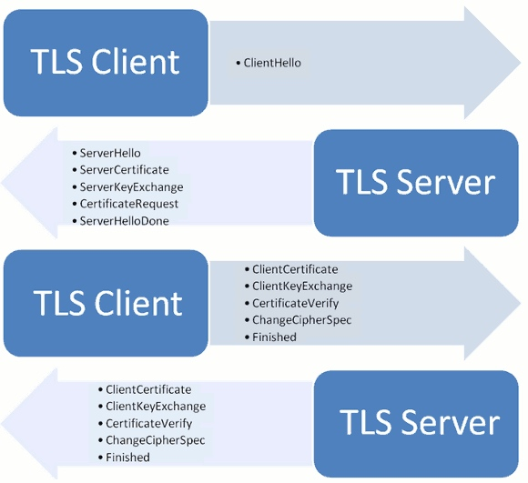
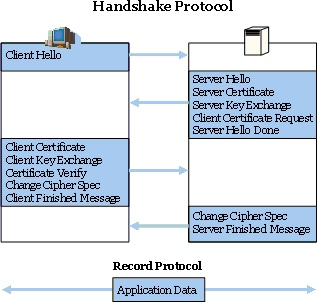

HTTPS详解

# TCP/IP

OSI模型中，网络被分为七层，由底层向高层依次是：物理层、数据链路层、网络层、传输层、会话层、表示层和应用层

1、物理层：处于OSI七层模型的最底层，它的主要任务是将Bits于电子信号进行转换
2、数据链路层：处于OSI七层模型的第二层，它定义了通过通信介质相互连接的设备之间，数据传输的规范
数据链路层油两个重要的概念：MAC地址和分组交换
MAC地址：
MAC地址是被烧录在网卡ROM中的一串数字，长度为48bit，它是世界范围内唯一的。由于MAC地址的唯一性，它可以被用来区分不同的节点，一旦指定了MAC地址，就不可能出现不知道往哪个设备传输数据的情况
3、

# SSL/TLS协议运行机制
[SSL/TLS协议运行机制的概述](http://www.jianshu.com/notebooks/3276500/latest)

## 目的
目前HTTP通信大部分是明文传播，具有三大风险

* 窃听（eavesdropping）：第三方可以获取通信内容
* 篡改（tampering）：第三方可以修改通信内容
* 冒充（pretending）：第三方可以冒充他人身份参与通信

SSL/TLS协议是为了解决上述三个风险而设计的，希望达到：

* 所有信息都是`加密传播`，第三方无法窃听
* 具有`校验机制`，一旦被篡改，通信双方立刻发现
* 配备`身份证书`，防止身份被冒充

## 历史
互联网加密通信协议的历史，几乎与互联网一样长

>1994年，NetScape公司设计了SSL协议（Secure Sockets Layer）的1.0版，但是未发布。
>1995年，NetScape公司发布SSL 2.0版，很快发现有严重漏洞。
>1996年，SSL 3.0版问世，得到大规模应用。
>1999年，互联网标准化组织ISOC接替NetScape公司，发布了SSL的升级版TLS 1.0版。
>2006年和2008年，TLS进行了两次升级，分别为TLS 1.1版和TLS 1.2版。最新的变动是2011年TLS 1.2的修订版

## 基本运动机制

SSL/TLS协议的基本思路是采用公钥加密，也就是说客户端需要先向服务器所要公钥，然后用公钥加密信息，服务器收到密文后，用自己的私钥解密
有两个问题：
1、如何保证公钥不被篡改
	解决办法：将公钥放在[数字证书](https://en.wikipedia.org/wiki/Digital_certificate)中。只要证书可信，公钥就可信
2、公钥加密计算量大，如何减少耗用时间
	解决办法：每一次对话（session）。客户端和服务器都生成一个“对话密钥”（session key），用它来加密。由于“对话密钥”是对称加密的，所有运算速度非常快，而服务器公钥只用于加密“对话密钥”本身，这样就减少了加密运算的消耗时间
	
大致的过程如下：

* 客户端向服务器所要并验证公钥
* 双方协商生成“对话密钥”
* 双方采用“对话密钥”进行加密通信

上面过程的前两步，又称为“握手阶段”（handshake）

## 握手详细过程

“握手阶段”涉及四次通信，均是采用明文

### 客户端发送请求（ClientHello）
首先，客户端（App或浏览器）先向服务器发出加密通信的请求
这一步中，客户端向服务器提供的信息主要如下：

* 支持的协议版本，比如TLS 1.0版
* 一个客户端生产的随机数，稍后用于生成“对话密钥”
* 支持的加密算法，比如RSA公钥加密
* 支持的压缩算法
这里需要注意，客户端发送的信息中不包括服务端的域名。理论上服务器一般包含一个域名，否则会出现不知道向客户端提供哪一个数字证书。
对于虚拟主机的用户来说，这当然不方便。2006年，TLS协议加入了一个[Service Name Indication扩展](https://tools.ietf.org/html/rfc4366)，允许客户端向服务器提供它所请求的域名

### 服务器响应（ServerHello）

服务器收到客户端请求后，向客户端发出回应，这叫ServerHello。服务器的回应包含以下内容

* 确认使用的加密通信协议版本，如TSL 1.0版本，如果客户端于服务器支持的版本不一致，服务器则关闭加密通信
* 一个服务器生成的随机数，稍后用于生成“对话密钥”
* 确认使用的加密方法，比如RSA公钥加密
* 服务器证书
除了上面的信息外，如果服务器需要确认客户端的身份，就会在包含一项请求，要求客户端提供“客户端证书”。比如，金融机构往往只允许认证客户连接自己的网络，就是向正式客户提供USB密钥，里面包含一张客户端证书

### 客户端响应
客户端收到服务器回应后，首先验证服务器证书。如果证书不是可信机构颁布、或者证书中的域名与实际域名不一致、或者证书已经过期，就会向访问者显示一个警告，由器选择是否继续通信

如果证书没有问题，客户端就会从证书中取出服务器的公钥。然后，向服务器发送下面三项信息：

* 一个随机数，该随机数用服务器公钥加密，防止被窃听
* 编码改变通知，表示随后的信息都将用双方商定的加密方法和密钥发送
* 客户端握手结束通知，表示客户端的握手阶段已经结束。这一项同时也是前面发送的所有内容的hash值，用来供服务器校验

上面第一项的随机数，是整改握手阶段出现的第三个随机数，又称“pre-master key”。有了它以后，客户端和服务器就同时有了三个随机数，接着双方用事先商定的加密方法，各自生成本次会话用的同一把“会话密钥”
至于为什么一定要用三个随机数，来生成“会话密钥”，[这篇文章](http://blog.csdn.net/dog250/article/details/5717162)作出了较好的解释：

> 不管是客户端还是服务器，都需要随机数，这样生成的密钥才不会每次都一样。由于SSL协议中证书都静态的，因此十分有必要引入一种随机因素来保证协商出来的密钥的随机性。
> 对于RSA密钥交换算法来说，pre-master-key 本身就是一个随机数，再加上hello消息中的随机，三个随机数通过一个密钥导出器最终导出一个对称密钥
> pre master的存在在于SSL协议不信任每个主机都能产生完全随机的随机数，如果随机数不随机，那么pre master secret就有可能被猜出来，那仅使用pre master secret作为密钥就不合适了，因此必须引入新的随机数。使用客户端和服务器加上pre master secret三个随机数一同生成的密钥就不容易被猜出来，一个伪随机可能完全不随机，可是三个伪随机就十分接近随机，每增加一个自由度，随机性增加的可不是一

此外，如果前一步，服务器要求客户端证书，客户端会在这一步发送证书及相关信息

### 服务器的最后回应
服务器收到客户端的三个随机数pre-master key之后，计算生成本次会话所用的“会话密钥”。然后向客户端最后发送下面的信息

* 编码改变通知，标示随后的信息都将用双方商定的加密方法和密钥发送
* 服务器握手结束通知，表示服务器的握手阶段已经结束。这一项同时也是前面发送的所有内容的hash值，用来供客户端校验

至此，整个握手阶段全部结束。接下来，客户端和服务器进入加密通信，完全是使用普通的HTTP协议，使用“会话密钥”加密内容

# 参考文档
http://www.jianshu.com/notebooks/3276500/latest

