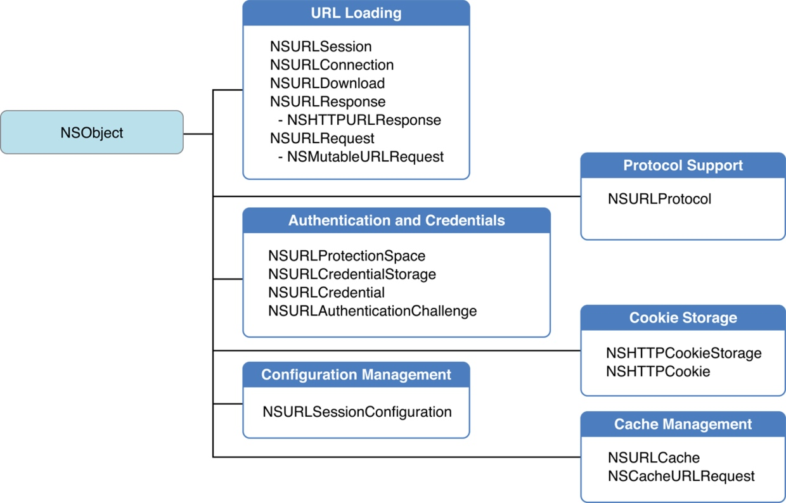

NSURLProtocol
[TOC]
# NSURLProtocol
`NSURLProtocol`是苹果为我们提供的[URL Loading System](https://developer.apple.com/library/content/documentation/Cocoa/Conceptual/URLLoadingSystem/URLLoadingSystem.html)的一部分
，能够让你重新定义苹果的URL加载系统（URL Loading System），[URL Loading System](https://developer.apple.com/library/content/documentation/Cocoa/Conceptual/URLLoadingSystem/URLLoadingSystem.html)里面有许多用于处理URL请求的类，如NSURL，NSURLRequst和 NSURLSession等，当[URL Loading System](https://developer.apple.com/library/content/documentation/Cocoa/Conceptual/URLLoadingSystem/URLLoadingSystem.html)使用NSURLRequest去获取资源时，它会创建一个NSURLProtocol子类的实例（用户不可以直接实例化一个NSURLProtocol，NSURLProtocol看似是一个协议，其实是一个类），而且使用该类的子类时，需要注册



官方文档对`NSURLProtocol`的描述是这样的

 > An NSURLProtocol object handles the loading of protocol-specific URL data. The NSURLProtocol class itself is an abstract class that provides the infrastructure for processing URLs with a specific URL scheme. You create subclasses for any custom protocols or URL schemes that your app supports.


在每一个 HTTP 请求开始时，URL 加载系统创建一个合适的`NSURLProtocol`对象处理对应的 URL 请求，而我们需要做的就是写一个继承自`NSURLProtocol`的类，并通过`- registerClass:`方法注册自定义的协议类，然后 URL 加载系统就会在请求发出时使用创建的协议对象对该请求进行处理。

因此，需要解决的核心问题就变成了如何使用`NSURLProtocol`来处理所有的网络请求，这里使用苹果官方文档中的[CustomHTTPProtocol](https://developer.apple.com/library/ios/samplecode/CustomHTTPProtocol/CustomHTTPProtocol.zip)进行介绍，你可以点击[这里](https://developer.apple.com/library/ios/samplecode/CustomHTTPProtocol/CustomHTTPProtocol.zip)下载源代码。

## 如何使用 NSURLProtocol 拦截 HTTP 请求？

有这个么几个问题需要去解决：

* 如何决定哪些请求需要当前协议对象处理？
* 对当前的请求对象需要进行哪些处理？
* NSURLProtocol 如何实例化？
* 如何发出 HTTP 请求并且将响应传递给调用者？

## 使用场景
不管是通过UIWebView还是通过NSURLSession，都可以通过NSURLProtocol进行自定义操作

* 重定向网络请求
* 忽略网络请求，使用本地缓存
* 自定义网络请求的返回结果
* 一些全局的网络请求设置

## 实现自定义NSURLProtocol子类

```
@interface CustomURLProtocol : NSURLProtocol
@end

//注册protocol
[NSURLProtocol registerClass:[CustomURLProtocol class]];
```

> 当有多个自定义NSURLProtocol注册到系统中的话，会按照他们注册的反向顺序依次调用URL加载流程。当其中有一个NSURLProtocol拦截到请求的话，后续的NSURLProtocol就无法拦截到该请求


### 实现CustomURLProtocol

基本方法

* canInitWithRequest: 

这个方法主要是说明是否打算处理对应的request，如果不处理，返回NO，URL Loading System会使用系统默认的行为去处理；如果需要处理，返回YES，然后你就需要处理该请求的所有东西，包括获取请求数据并返回给 URL Loading System。网络数据可以简单的通过NSURLSession去获取，而且每个NSURLProtocol对象都有一个NSURLProtocolClient实例，可以通过该client将获取到的数据返回给URL Loading System。
这里有个需要注意的地方，想象一下，当你去加载一个URL资源的时候，URL Loading System会询问CustomURLProtocol是否能处理该请求，你返回YES，然后URL Loading System会创建一个CustomURLProtocol实例然后调用NSURLSession去获取数据，然而这也会调用URL Loading System，而你在+canInitWithRequest:中又总是返回YES，这样URL Loading System又会创建一个CustomURLProtocol实例导致无限循环。因此要保证每个request只被处理一次，可以通过+setProperty:forKey:inRequest:标示那些已经处理过的request，然后在+canInitWithRequest:中查询该request是否已经处理过了，如果是则返回NO。

```
+ (BOOL)canInitWithRequest:(NSURLRequest *)request
{
  //只处理http和https请求
    NSString *scheme = [[request URL] scheme];
    if ( ([scheme caseInsensitiveCompare:@"http"] == NSOrderedSame ||
     [scheme caseInsensitiveCompare:@"https"] == NSOrderedSame))
    {
        //看看是否已经处理过了，防止无限循环
        if ([NSURLProtocol propertyForKey:URLProtocolHandledKey inRequest:request]) {
            return NO;
        }

        return YES;
    }
    return NO;
}
```
* +canonicalRequestForRequest:
这是一个抽象方法，子类必须实现
通常可以重新设置或者修改request的信息。比如请求重定向或者添加头部信息等等。如果没有特殊需求，直接返回request就可以了。但是因为这个方法在会在一次请求中被调用多次（暂时我也不知道什么原因为什么需要回调多次），所以request重定向和添加头部信息也可以在开始加载中startLoading方法中重新设置

```
+ (NSURLRequest *) canonicalRequestForRequest:(NSURLRequest *)request {
    NSMutableURLRequest *mutableReqeust = [request mutableCopy];
    mutableReqeust = [self redirectHostInRequset:mutableReqeust];
    return mutableReqeust;
}

+(NSMutableURLRequest*)redirectHostInRequset:(NSMutableURLRequest*)request
{
    if ([request.URL host].length == 0) {
        return request;
    }

    NSString *originUrlString = [request.URL absoluteString];
    NSString *originHostString = [request.URL host];
    NSRange hostRange = [originUrlString rangeOfString:originHostString];
    if (hostRange.location == NSNotFound) {
        return request;
    }
    //定向到bing搜索主页
    NSString *ip = @"cn.bing.com";

    // 替换域名
    NSString *urlString = [originUrlString stringByReplacingCharactersInRange:hostRange withString:ip];
    NSURL *url = [NSURL URLWithString:urlString];
    request.URL = url;

    return request;
}
```

* +requestIsCacheEquicalent: toRequest:
主要判断两个request是否相同，如果相同的话可以使用缓存数据，通常只需要调用父类的实现

```
+ (BOOL)requestIsCacheEquivalent:(NSURLRequest *)a toRequest:(NSURLRequest *)b
{
    return [super requestIsCacheEquivalent:a toRequest:b];
}
```
* -startLoading
* -stopLoading

```
- (void)startLoading
{

    /* 如果想直接返回缓存的结果，构建一个NSURLResponse对象
    if (cachedResponse) {
        
        NSData *data = cachedResponse.data; //缓存的数据
        NSString *mimeType = cachedResponse.mimeType;
        NSString *encoding = cachedResponse.encoding;
        
        NSURLResponse *response = [[NSURLResponse alloc] initWithURL:self.request.URL
                                                            MIMEType:mimeType
                                               expectedContentLength:data.length
                                                    textEncodingName:encoding];
        
        [self.client URLProtocol:self didReceiveResponse:response cacheStoragePolicy:NSURLCacheStorageNotAllowed];
        [self.client URLProtocol:self didLoadData:data];
        [self.client URLProtocolDidFinishLoading:self];
    */

    NSMutableURLRequest *mutableReqeust = [[self request] mutableCopy];
    //标示改request已经处理过了，防止无限循环
    [NSURLProtocol setProperty:@YES forKey:URLProtocolHandledKey inRequest:mutableReqeust];
    self.connection = [NSURLConnection connectionWithRequest:mutableReqeust delegate:self];
}

- (void)stopLoading
{
    [self.connection cancel];
}
```

## 
需要注意的是 NSURLProtocol 只能拦截 NSURLConnection、NSURLSession 和 UIWebView 中的请求，对于 WKWebView 中发出的网络请求也无能为力，如果真的要拦截来自 WKWebView 中的请求，还是需要实现 WKWebView 对应的 WKNavigationDelegate，并在代理方法中获取请求。
无论是 NSURLProtocol、NSURLConnection 还是 NSURLSession 都会走底层的 socket，但是 WKWebView 可能由于基于 WebKit，并不会执行 C socket 相关的函数对 HTTP 请求进行处理，具体会执行什么代码暂时不是很清楚

## NSURLProtocolClient
`NSURLProtocol`定义了一系列加载的流程，接下来就是相关`NSURLProtocolClient`的方法调用

```
@protocol NSURLProtocolClient <NSObject>

//请求重定向
- (void)URLProtocol:(NSURLProtocol *)protocol wasRedirectedToRequest:(NSURLRequest *)request redirectResponse:(NSURLResponse *)redirectResponse;

// 响应缓存是否合法
- (void)URLProtocol:(NSURLProtocol *)protocol cachedResponseIsValid:(NSCachedURLResponse *)cachedResponse;

//刚接收到Response信息
- (void)URLProtocol:(NSURLProtocol *)protocol didReceiveResponse:(NSURLResponse *)response cacheStoragePolicy:(NSURLCacheStoragePolicy)policy;

//数据加载成功
- (void)URLProtocol:(NSURLProtocol *)protocol didLoadData:(NSData *)data;

//数据完成加载
- (void)URLProtocolDidFinishLoading:(NSURLProtocol *)protocol;

//数据加载失败
- (void)URLProtocol:(NSURLProtocol *)protocol didFailWithError:(NSError *)error;

//为指定的请求启动验证
- (void)URLProtocol:(NSURLProtocol *)protocol didReceiveAuthenticationChallenge:(NSURLAuthenticationChallenge *)challenge;

//为指定的请求取消验证
- (void)URLProtocol:(NSURLProtocol *)protocol didCancelAuthenticationChallenge:(NSURLAuthenticationChallenge *)challenge;

@end
```


## 参考文档
[NSURLProtocol](https://developer.apple.com/reference/foundation/urlprotocol)
[iOS中的 NSURLProtocol](http://www.jianshu.com/p/0244e431fb3c)
[iOS开发之--- NSURLProtocol](http://www.jianshu.com/p/7c89b8c5482a)
[iOS H5容器的一些探究（二）：iOS下的黑魔法NSURLProtocol](http://www.jianshu.com/p/03ddcfe5ebd7)

