iOS项目集成ReactNative

[TOC]

## iOS项目集成ReactNative

现有的iOS项目集成ReactNative主要有两种方式
* 使用cocoapods（推荐使用，特别是已经使用了cocoapods的项目）
* 手动集成
下面简单的介绍下如何集成ReactNative到现有的iOS项目中
> 前提是已经配置好了`ReactNative`命令环境

## 使用cocoapods集成
[官方中文0.27版](http://reactnative.cn/docs/0.27/embedded-app-ios.html#content)介绍了使用`cocoapods`集成`ReactNative`

现在较多的iOS项目工程采用`cocoapods`进行第三方库依赖管理，而且使用这种方式集成ReactNative相对的方便一点

首先确保你的工程已经采用了`cocoapods`进行依赖管理，如果没有则自行进行设置
### 初始化ReactNative环境
在工程文件目录下新建一个ReactNativeComponent文件夹，用于存放ReactNative相关文件（也可以不创建，直接存放在当前工程目录下），新建一个package.json文件
> npm就是通过这个文件来进行第三库依赖的管理

```
{
  "name": "ReactNativeApp",
  "version": "0.0.1",
  "private": true,
  "scripts": {
    "start": "node node_modules/react-native/local-cli/cli.js start"
  },
  "dependencies": {
    "react": "15.3.1",
    "react-native": "0.33.0"
  }
}
```
http://www.tqcto.com/article/mobile/145770.html
执行

```
$ npm install
```
### 创建index.ios.js文档
在package.json文件所在目录下创建React Native入口文件

```
import React, { Component } from 'react';
import {
  AppRegistry,
  StyleSheet,
  Text,
  View
} from 'react-native';

class ReactNativeApp extends Component {
  render() {
    return (
      <View style={styles.container}>
        <Text style={styles.welcome}>
          Welcome to React Native!
        </Text>
        <Text style={styles.instructions}>
          To get started, edit index.ios.js
        </Text>
        <Text style={styles.instructions}>
          Press Cmd+R to reload,{'\n'}
          Cmd+D or shake for dev menu
        </Text>
      </View>
    );
  }
}

const styles = StyleSheet.create({
  container: {
    flex: 1,
    justifyContent: 'center',
    alignItems: 'center',
    backgroundColor: '#F5FCFF',
  },
  welcome: {
    fontSize: 20,
    textAlign: 'center',
    margin: 10,
  },
  instructions: {
    textAlign: 'center',
    color: '#333333',
    marginBottom: 5,
  },
});

AppRegistry.registerComponent('ReactNativeApp', () => ReactNativeApp);
```
### cocoaPods关联ReactNative
使用cocoaPods来将ReactNative的项目和iOS项目关联起来，其中的`path`为node_modules的react-native，并且subspecs中指定的库，如果还需要其他的使用其他相关的库，在这里指定下

```
# Uncomment this line to define a global platform for your project
# platform :ios, '9.0'

target 'TestReactNative' do
  # Uncomment this line if you're using Swift or would like to use dynamic frameworks
  # use_frameworks!

  # Pods for TestReactNative

  pod 'React', :path => './node_modules/react-native', :subspecs => [
    'Core',
    'ART',
    'RCTActionSheet',
    'RCTAdSupport',
    'RCTGeolocation',
    'RCTImage',
    'RCTNetwork',
    'RCTPushNotification',
    'RCTSettings',
    'RCTText',
    'RCTWebSocket', # needed for debugging
    # Add any other subspecs you want to use in your project
  ]

  target 'TestReactNativeTests' do
    inherit! :search_paths
    # Pods for testing
  end

  target 'TestReactNativeUITests' do
    inherit! :search_paths
    # Pods for testing
  end

end
```
设置完`Podfile`后执行`pod install`

### 使用ReactNative

iOS端入口代码：

```
#import "ViewController.h"
#import "RCTBundleURLProvider.h"
#import "RCTRootView.h"

@interface ViewController ()

@property(nonatomic, strong) RCTRootView *rootView;

@end

@implementation ViewController

- (void)viewDidLoad {
    [super viewDidLoad];
    NSURL *jsCodeLocation = [[RCTBundleURLProvider sharedSettings] jsBundleURLForBundleRoot:@"index.ios" fallbackResource:nil];
    self.rootView = [[RCTRootView alloc] initWithBundleURL:jsCodeLocation
                                                        moduleName:@"ReactNativeApp"
                                                 initialProperties:nil
                                                     launchOptions:nil];
    self.view =self.rootView;
}

@end
```
>其中新版本中，真机测试时也不需要修改server的ip地址了，只要是同一个网段就可以访问到了

### 测试
1. 启动服务器 `npm start`
2. 设置连接到js管理的服务器，修改`info.plist`

### 参考文档
[集成React Native到现有iOS项目](http://www.jianshu.com/p/80d212a3b067)
[ios原生集成React Native](http://blog.csdn.net/lotheve/article/details/50594290)

## 手动集成提示
目前react-native是基于git管理的，可能pod上不是最新的版本的，手动集成可以切换到最新的版本

1、 将React-Native的仓库作为一个submodule添加到项目的仓库下

```
git submodule add https://github.com/facebook/react-native.git
```
2、进入react-native目录下，切换到最新发布的版本

```
cd react-native
git checkout -b 033ReleaseVersion v0.33.0 
// 如0.33.0版本
```
3、安装组建
执行`npm install`

## 手动集成方案一

### 初始化ReactNative环境
进入到`*.xcodeproj`文件的上级目录，运行`ReactNative`初始化命令`react-native init [Project Name]`（init过程需要点时间，请耐心等待）
出现`prompt`选项，出入`YES`，这样会在iOS目录下生成一个同名工程
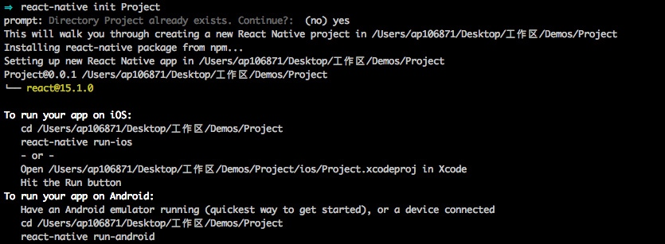
命令执行完后，项目的文件目录变成：
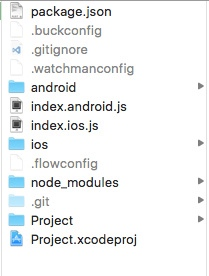

* node_modules:react native依赖包
* ios:iOS项目相关代码，Xcode工程文件
* android:Android项目相关代码
* index.ios.js:iOS平台加载的JS脚本
* index.android.js：Android平台加载的JS脚本
* package.json：当前项目的npm package的配置文件（npm就是通过这个文件来进行第三库依赖的管理），其具体内容如下：

```
{
  "private": true,
  "scripts": {
    "start": "node node_modules/react-native/local-cli/cli.js start"
  },
  "name": "Project", //注意此name
  "dependencies": {
    "react": "^15.1.0",
    "react-native": "^0.27.2"
  },
  "version": "0.0.1"
}
```
在iOS项目中用不到Android相关文档，需要把它们删除，具体文档有：

* android
* index.android.js
* node_modules/react-native/android
* node_modules/react-native/ReactAndroid

### 添加ReactNative的Libraries
打开iOS目录下的同名工程，可以看到工程中具体引用的ReactNative库如下：
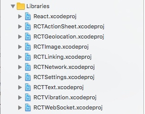
将它们加入到原有的iOS工程中，推荐新建一个file group存放

### 添加ReactNative shell脚本
ReactNative的iOS项目在编译时会先运行一个shell脚本，其作用有两个：

* 从Terminal启动啦一个Node.js的server用于ReactNative调试
* 将ReactNative的资源文件打包放在编译目录下
具体的添加如下所示：
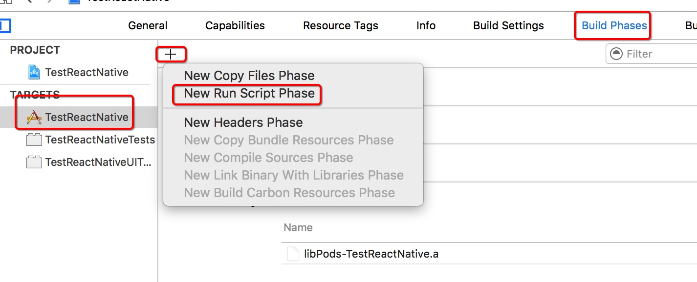
* 选择`New Run Script Phase`添加一个脚本，自行命名，如`Bundle React Native code and images`
* 把iOS下工程的脚本引用代码复制过程，具体如下图所示。
> 注意路径，因为我们的原有`*.xcodeproj`文件和`node_modules`是在同一个目录下，所有要去掉两个点中的一个点
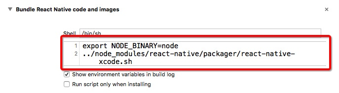

### 链接.a文件和添加搜索头文件的地址
* 到这一步，可以删除掉iOS目录了，重新打开原有工程。在工程的`Bulid Phase`的`Link Binary With Libraries`，点击`+`号，可以`Workspace`下的较多`.a`文件，具体如下图所示，将它们全部添加
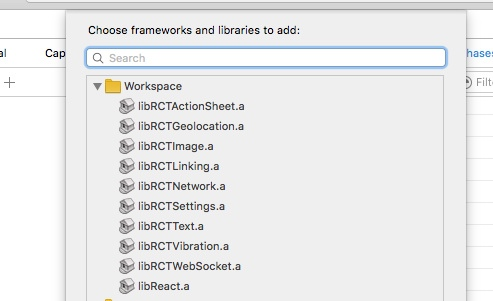

* 接下来添加搜索头文件，在`TARGETS->Build Settings->Header Search Paths`中添加一条`$(SRCROOT)/node_modules/react-native/React`，选择`recursive`，如下图所示
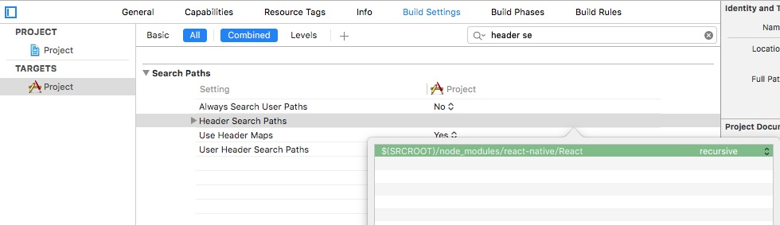

### 编译
先编译一下，会发现编译不通过,一堆报错。 原因是我们还没有导入JavaScriptCore库。因为React Native与原生的交互需要依赖于JavaScriptCore.framework。 再次编译，发现可以编译成功了

### 测试
在`AppDelegate.m`中的`didFinishLaunchingWithOptions:`方法中添加如下代码：

```
RCTRootView *rootView = [[RCTRootView alloc] initWithBundleURL:jsCodeLocation
                                                      moduleName:@"Project"
                                               initialProperties:nil
                                                   launchOptions:launchOptions];
  rootView.backgroundColor = [[UIColor alloc] initWithRed:1.0f green:1.0f blue:1.0f alpha:1];

  self.window = [[UIWindow alloc] initWithFrame:[UIScreen mainScreen].bounds];
  UIViewController *rootViewController = [UIViewController new];
  rootViewController.view = rootView;
  self.window.rootViewController = rootViewController;
  [self.window makeKeyAndVisible];
```
运行成功如下图
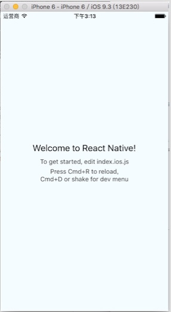

### 参考文档
https://github.com/huxiaoqiao/React-Native-Study/blob/master/Blog/iOS%E7%8E%B0%E6%9C%89%E9%A1%B9%E7%9B%AE%E9%9B%86%E6%88%90React%20Native.md

## 手动集成方案二

### 安装ReactNative
首先在项目工程目录下创建一个package.json文件，用于初始化ReactNative（也可以新建一个文件夹，将package.json文件，在新建的文件夹中初始化ReactComponent）
> npm就是通过这个文件来进行第三库依赖的管理
package.json文件具体内容如下：

```
//具体借用[官方文档](https://facebook.github.io/react-native/docs/integration-with-existing-apps.html)
{
  "name": "NumberTileGame", //你的项目工程名
  "version": "0.0.1",
  "private": true,
  "scripts": {
    "start": "node node_modules/react-native/local-cli/cli.js start"
  },
  "dependencies": { 
    "react": "15.0.2",
    "react-native": "0.26.1"
  }
  //dependencies中的react指的是React的版本号，react-native就是React-Native的版本号
}
```
在package.json的所在目录下执行 `npm install` 命令
安装成功后会产生一个node_modules目录，里面就是react-native依赖的所有项目包

> From the directory containing package.json project, install the modules
> The modules will be installed in node_modules/
> $ npm install

### 新建index.ios.js文件
在package.json当前目录下新建一个`index.ios.json`文件

> $ touch index.ios.js

```
import React, { Component } from 'react';
import {
  AppRegistry,
  StyleSheet,
  Text,
  View,
  TouchableOpacity,
} from 'react-native';
// ReactiOS是自定义的，可以自行命名
class ReactiOS extends Component {
  render() {
    return (
      <View style={styles.container}>
           <Text>Hello World!</Text>
      </View>
    );
  }
}

const styles = StyleSheet.create({
  container: {
    backgroundColor : 'red ',
    height:100,
    flexDirection : 'row '
  },
});

AppRegistry.registerComponent('ReactiOS', () => ReactiOS);
```
index.ios.js文件内容如上，这就是js程序的入口文件。到这里基本完成react-native的准备工作，下面就是开始集成

### 手动集成react-native

#### 添加react-native工程文件
由于这里采用手动集成，没有采用cocoapods进行（工程没有采用cocoapods进行第三方依赖包管理），所有手动将react-native工程包添加到现有的iOS工程中
进入`/node_modules/react-native`目录下，找到相关的项目包，
新建一个文件组，将`React`相关的工程包手动添加到项目文件组中：

```
添加`react-native/React/React.xcodeproj`到项目中
添加`react-native/Libraries／ActionSheetIOS/RCTActionSheet.xcodeproj`到项目中
添加`react-native/Libraries／LinkingIOS/RCTLinking.xcodeproj`到项目中
添加`react-native/Libraries／Image/RCTImage.xcodeproj`到项目中
添加`react-native/Libraries／Network/RCTNetwork.xcodeproj`到项目中
添加`react-native/Libraries／Text/RCTText.xcodeproj`到项目中
添加`react-native/Libraries／WebSocket/RCTWebSocket.xcodeproj`到项目中
```
根据具体的需求，需要什么就添加对应的工程包

#### 添加相关的frameworks文件
下面添加对应的`frameworks`文件到工程中
具体的添加位置如图所示：
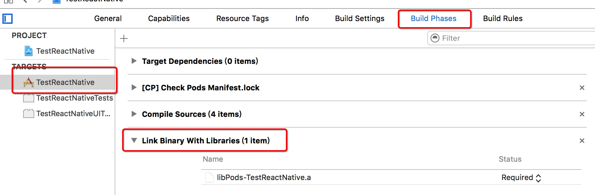
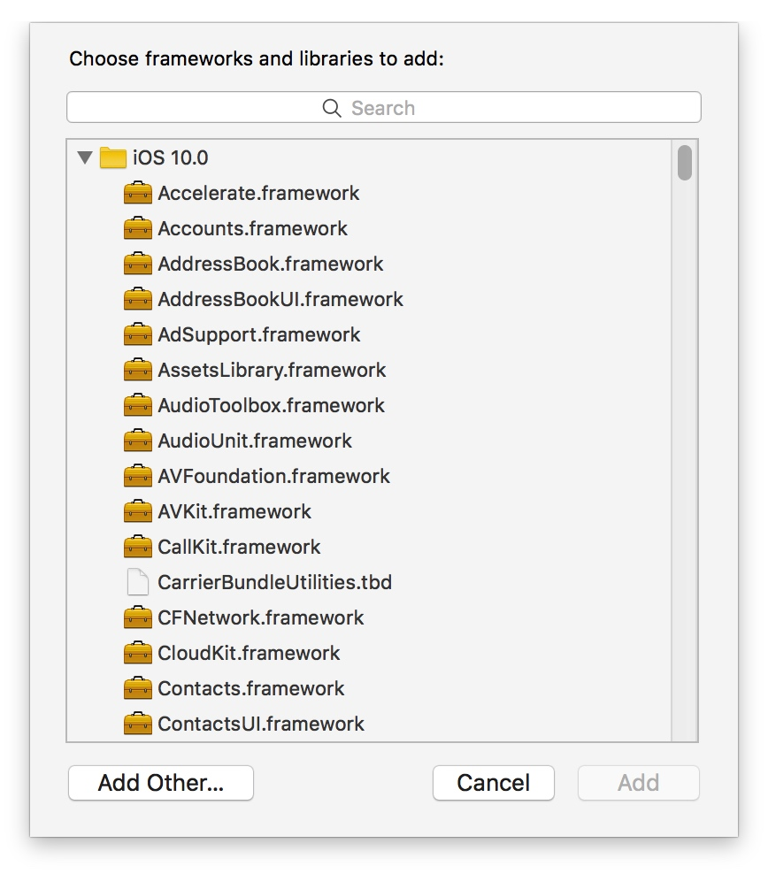

将需要的`.a`文件添加
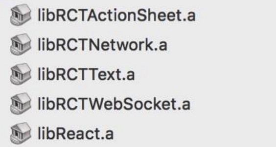
添加搜索头文件的地址
添加一条`$(SRCROOT)/node_modules/react-native/React` (如果新建了一个文件存放react-native的话为$(SRCROOT)/（文件如：reactnative）/node_modules/react-native/React)，并选择`recursive`
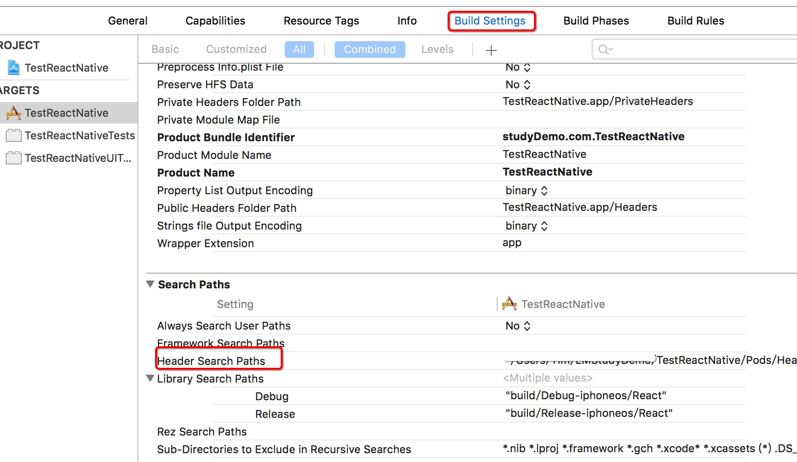

到此完成了手动集成ReactNative到iOS项目中

### 编译

xcode8中
`RCTScrollView`中提示`use of undeclared identifier _refreshControl...`等
解决办法：
把`_refreshControl`替换为`refreshControl`
https://github.com/facebook/react-native/issues/8472

编译后出现这样的错误
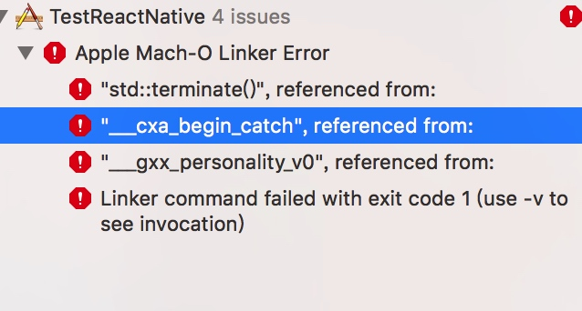

解决办法:
在`Build Phases -> Link Binary Width Libraries`中导入`libz.1.1.3.tbd`，`libstdc++.tbd`两个文件

### 测试
在`AppDelegate.m`中的`didFinishLaunchingWithOptions:`方法中添加如下代码：

```
RCTRootView *rootView = [[RCTRootView alloc] initWithBundleURL:jsCodeLocation
                                                      moduleName:@"ReactiOS"
                                               initialProperties:nil
                                                   launchOptions:launchOptions];
  rootView.backgroundColor = [[UIColor alloc] initWithRed:1.0f green:1.0f blue:1.0f alpha:1];

  self.window = [[UIWindow alloc] initWithFrame:[UIScreen mainScreen].bounds];
  UIViewController *rootViewController = [UIViewController new];
  rootViewController.view = rootView;
  self.window.rootViewController = rootViewController;
  [self.window makeKeyAndVisible];
```

### 参考文档
具体借鉴文档[React-Native与iOS原生的集成步骤](http://www.jianshu.com/p/3e2072cfb1f6)

## 注意事项

### 启动RN服务器
* 方法一
Cocoapods如何启动的

```
(JS_DIR=`pwd`/ReactComponent; cd Pods/React; npm run start -- --root $JS_DIR)

```
1. `JS_DIR=pwd/ReactComponent`找到放js的文件夹，保存到JS_DIR这个变量中
2. `cd Pods/React`进入react目录下
3. `npm run start -- --root $JS_DIR`将存放js文件的目录作为`--root`参数，然后使用`npm run start`启动服务

我们主要放React的目录不同，所以只要简单修改一下第二条命令就可以了
```
// ReactComponent 为自定义统一存放reactnative相关文件的地方
JS_DIR=`pwd`/ReactComponent; cd ReactComponent/node_modules/react-native; npm run start -- --root $JS_DIR
```

> 注意:JS_DIR变量是查找JS文件的目录，在本例中即为ReactComponent目录；cd后面的路径由实际的文档排版决定，保证进入到react-native（即packager所在的目录）

* 方案二

直接在package.json文件所在目录运行`npm start`

### 链接js服务器

出现不能链接到js管理的服务器，需要修改`info.plist`文件

```
<key>NSAppTransportSecurity</key>
    <dict>
        <key>NSAllowsArbitraryLoads</key>
        <true/>
    </dict>
```
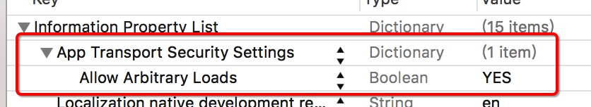


## 参考文档

[官方文档0.34](https://facebook.github.io/react-native/docs/integration-with-existing-apps.html)
[【iOS&Android】RN学习3——集成进现有原生项目](http://www.chaisong.xyz/2016/08/02/RN%E5%AD%A6%E4%B9%A03%E2%80%94%E2%80%94%E9%9B%86%E6%88%90%E8%BF%9B%E5%B7%B2%E6%9C%89%E5%8E%9F%E7%94%9F%E9%A1%B9%E7%9B%AE/)
[ios原生集成React Native](http://blog.csdn.net/lotheve/article/details/50594290)

[React-Native 教程 1 ： 集成React-Native到现有的iOS项目中](https://www.chenghu.me/?p=1399)


