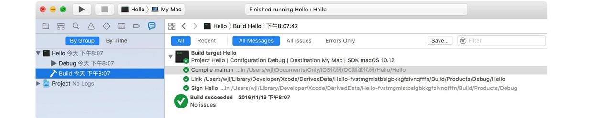
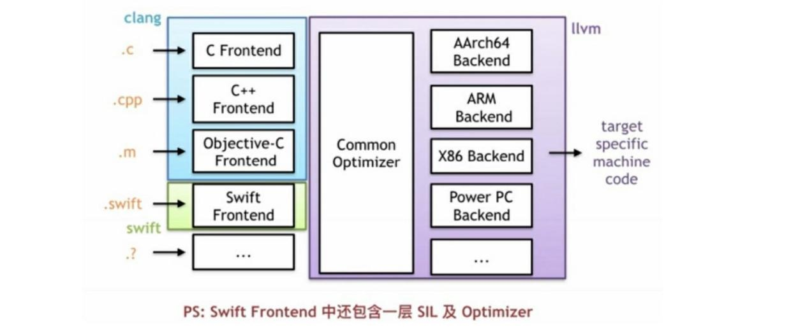
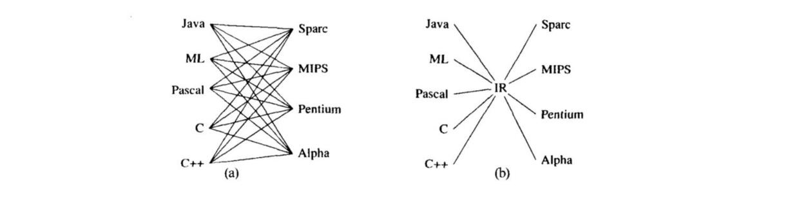
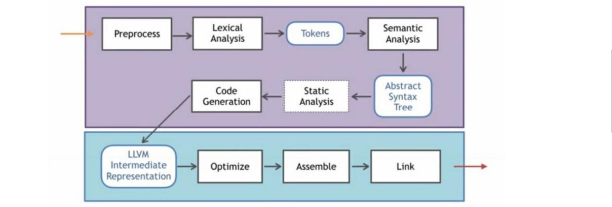
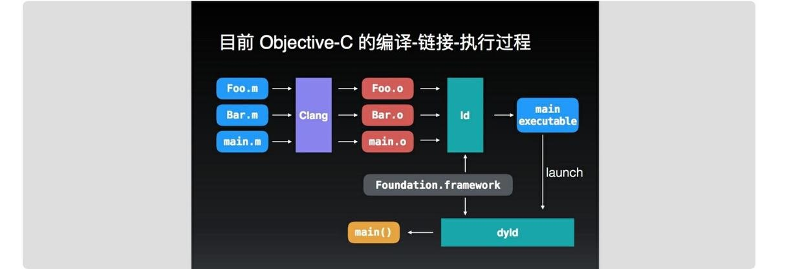

App Run

# App编译到运行
一个App主要经过编译、汇编、链接、代码签名和启动运行等几个操作

## 编译
编译主要依靠编译器来完成一系列工作，主要的操作有预处理、词法分析、语法分析、语义分析、生成中间代码、生成目标代码已经目标代码优化
OS X 现在使用的编译器是 LLVM （Low Level Virtual Machine），在最初使用的是 GCC作为官方的编译器，但是由于下面的众多限制，apple 使用了自己的一套编译器

* GCC 原名为GNU C语言编译器，它原本只能处理 C语言，后来扩展了Objective-C、Java等语言，但是对于Objective-C的处理还是存在众多不便
* GCC 效率低下、性能不强
* 苹果开发自己的编译器，有利于开展自己的工具链，比如后期做 Swift、lldb 等

LLVM的基本架构：

编译器分别编译器前端（clang）和编译器后端，编译器前端负责产生机器无关的中间代码，编译器后端负责对中间代码进行优化并转化为目标机器代码，对于为什么需要 中间代码这个东西，看个图就一目了然啦（IR：intermediate representation中间表示）

### 预编译
预编译主要用来处理那些源文件中以 #开头的预编译命令，比如#include等
### 词法分析
将输入分解为一个个独立的词法符号，也叫单词符号（token）
注释、宏、空格、换行等都不是单词
### 语法分析
将符号化的字符串，转化抽象为可以被计算机存储的树形结构，即抽象语法树（AST），并验证语法的正确性，例如：忘记带分号
### 语义分析
语法分析只能完成语法层面的分析，无法对整个语句的真正意义进行判别，比如，讲一个浮点数赋值指针类型的时候，语义分析器就会发现类型不匹配，编译器提出相应的错误警告。

语义分析主要做的事情就是类型检查、以及符号表管理

### 生成中间代码
编译器前端负责产生机器无关的中间代码，编译器后端负责对中间代码进行优化并转化为目标机器代码

### 目标代码的生成与优化
编译器后端主要包括代码生成器、代码优化器。代码生成器将中间代码转换为目标代码，代码优化器主要是进行一些优化，比如删除多余指令，选择合适寻址方式等

## 汇编
目标代码需要经过汇编器处理，才能变成机器上可以执行的指令。生成对应的.o文件

## 链接
链接器（这里指的是静态链接器）将多个目标文件合并为一个可执行文件，在 OS X 和 iOS中的可执行文件是 Mach-O，对于Mach-O的文件格式可以[参考这里](https://github.com/joy0304/Joy-Blog/blob/master/Blog/%E8%B6%A3%E6%8E%A2%20Mach-O%EF%BC%9A%E6%96%87%E4%BB%B6%E6%A0%BC%E5%BC%8F.md)，刚才所描述的过程其实可以用 sunnyxx的一页 ppt来进行总结

链接呢，又分为静态链接和动态链接

### 静态链接
静态链接：在编译链接期间发挥作用，把目标文件和静态库一起链接形成可执行文件
### 动态链接
动态链接：链接过程推迟到运行时再进行。对于动态链接和静态链接，各有千秋

* 如果多个程序都用到了一个库，那么每个程序都要将其链接到可执行文件中，非常冗余，动态链接的话，多个程序可以共享同一段代码，不需要在磁盘上存多份拷贝，但是动态链接发生在启动或运行时，增加了启动时间，造成一些性能的影响。
* 静态库不方便升级，必须重新编译，动态库的升级更加方便

## 代码签名
每次build之后，都会发现工程目录下多了一个.app文件
在 .app目录中，有又一个叫_CodeSignature的子目录，这是一个 plist文件，里面包含了程序的代码签名，你的程序一旦签名，就没有办法更改其中的任何东西，包括资源文件，可执行文件等，iOS系统会检查这个签名。

签名过程本身是由命令行工具 codesign 来完成的。如果你在 Xcode中build一个应用，这个应用构建完成之后会自动调用codesign 命令进行签名，这也是Link之后的一个关键步骤。

## 启动
在经过一系列处理后，终于形成一个可以在系统上跑起来的可执行程序，剩下的就是启动运行

其实在启动过程中，dyld（动态链接器） 起了很重要的作用，进行动态链接，进行符号和地址的一个绑定

dyld 主要在启动过程中主要做了以下事情：

* 加载所依赖的dylibs
* Fix-ups：Rebase修正地址偏移，因为 OS X和 iOS 搞了一个叫 ASLR的东西来做地址偏移（随机化）来避免收到攻击
* Fix-ups：Binding确定 Non-Lazy Pointer地址，进行符号地址绑定。
* ObjC runtime初始化：加载所有类
* Initializers：执行load 方法和__attribute__((constructor))修饰的函数

对于如何减少启动时间，今年的 WWDC 也有详细的阐述，可以在参考链接中找到相关的资料。

## 总结
那么总体的过程可以概括为：编译 – 汇编 – 静态链接 – 签名 – 启动（动态链接等操作）- 跑起来了

# 参考文档

[优化 App 的启动时间](http://yulingtianxia.com/blog/2016/10/30/Optimizing-App-Startup-Time/)

