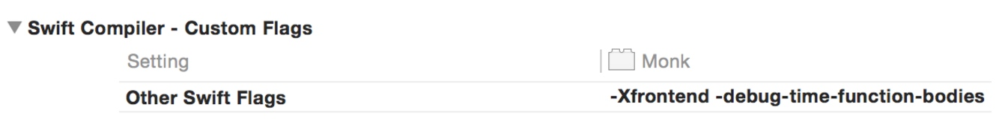

# App build时间统计

### project build时间
终端中运行下面命令 `defaults write com.apple.dt.Xcode ShowBuildOperationDuration YES`
注意： 运行命令前需要关闭xcode

### swift 时间统计
build settings中增加`-Xfrontend -debug-time-function-bodies` 

# 参考文章
http://irace.me/swift-profiling
http://stackoverflow.com/questions/31520133/output-compile-durations-for-swift-files
https://github.com/RobertGummesson/BuildTimeAnalyzer-for-Xcode

