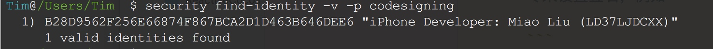
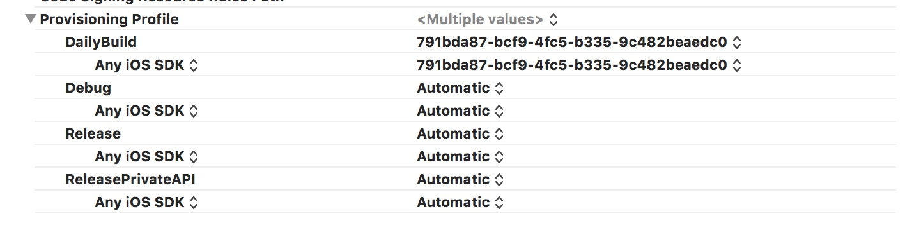
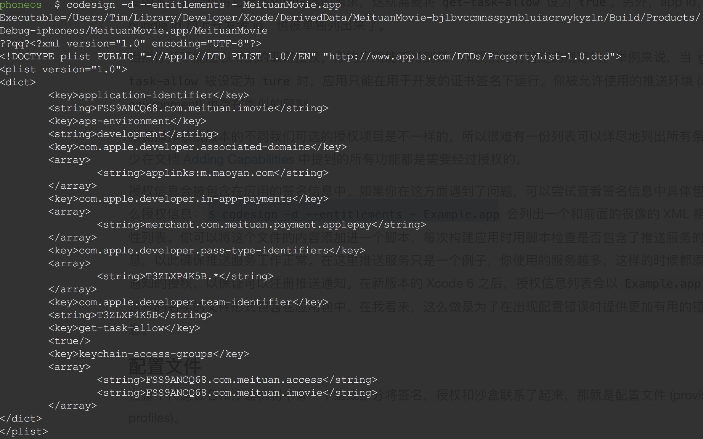
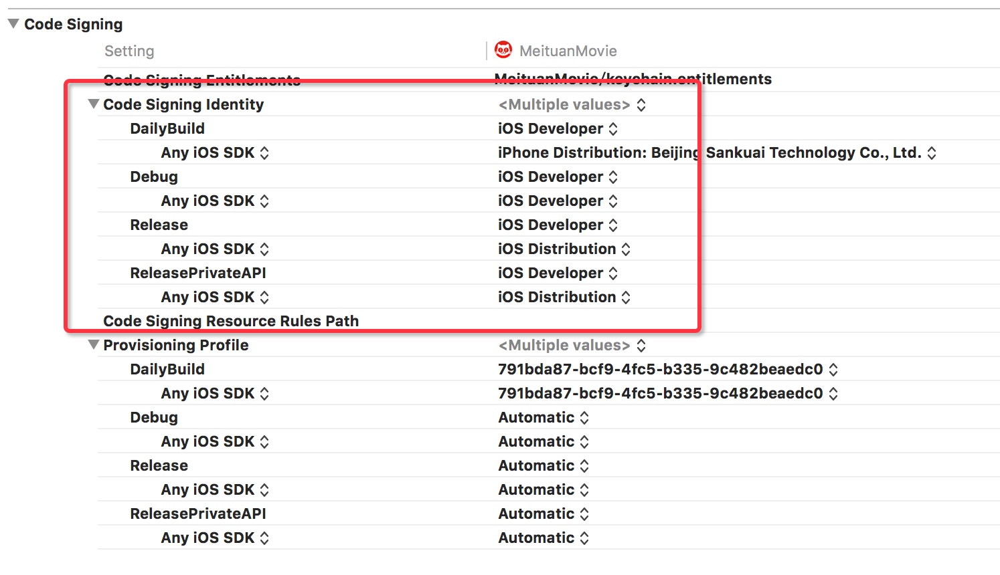
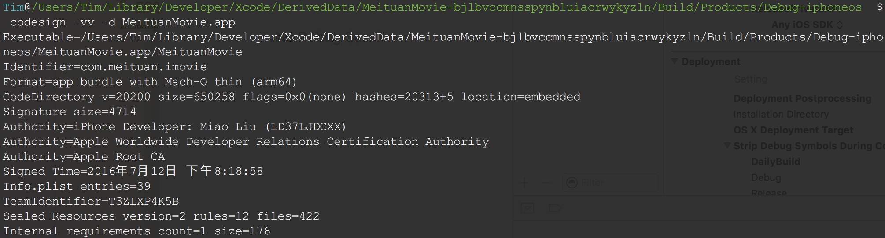
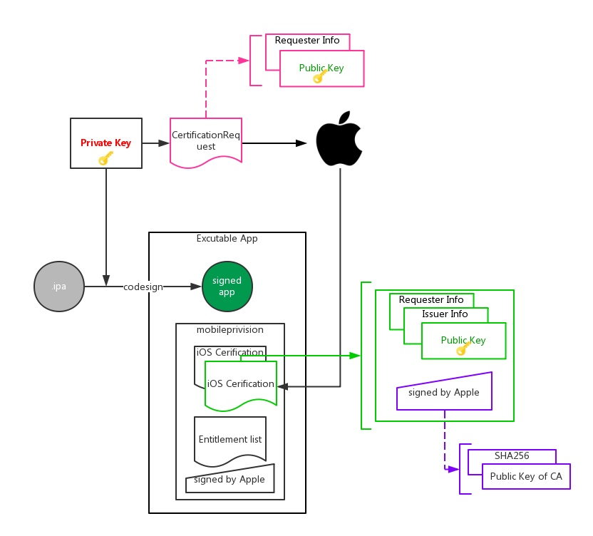
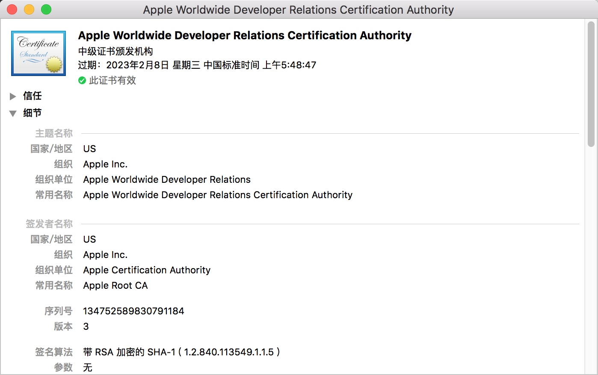
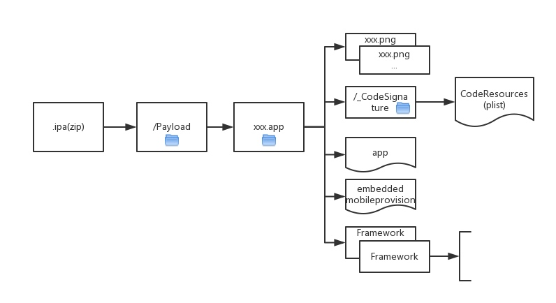
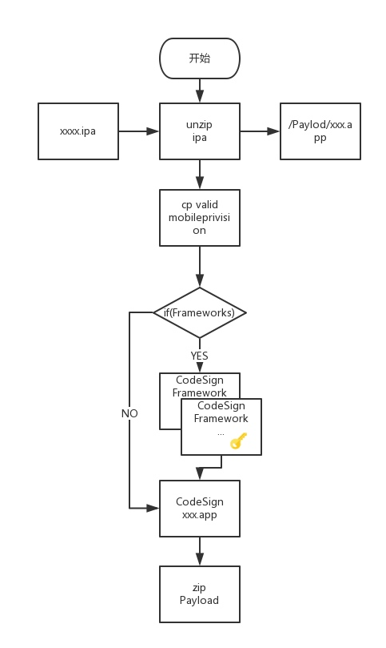

# App develop knowledge

 [TOC]

## 证书
对于iOS开发者来说，一般会有两个证书，一个带有前缀iPhone Developer，另一个带有前缀iPhone Distribution。
顾名思义，第一个可以使应用在测试设备上运行，第二个是应用于将App提交到App Store上

```
$ security find-identity -v -p codesigning
```
对应结果显示如下

图中显示的一个开发者账号和对应的可以用于代码签名的证书
## 密钥
## 描述文件（Provisioning profiles）
在整个代码签名和沙盒机制中，配置文件（Provisioning profiles）将签名、授权和沙盒联系起来。
一个配置文件中存放了系统用于判断你的应用是否允许运行的信息
一个配置文件时一组信息的集合，决定了一个应用是否能够在某一特定的设备上运行。配置文件可以用于让应用在你的开发设备上可以被运行和调试，也可以用于内部测试 (ad-hoc) 或者企业级应用的发布。

Xcode将从开发者中心下载的配置文件存放在`~/Library/MobileDevice/Provisioning Profiles`目录下.
Provisioning profiles文件不是一个plist文件，它是一个根据密码讯息语法 (Cryptographic Message Syntax) 加密的文件。采用CMS格式进行加密使得配置文件可以被设置签名。
配置文件的签名和应用的签名不是一回事，它是由苹果直接在开发者中心 (developer portal) 中设置好了的
可以通过下面命令进行查看，这个命令会输出签名信息中的内容，如果你亲自试一下，接下来你会得到一个 XML 格式的 plist 文件内容输出

```
$ security cms -D -i example.mobileprovision
```
这个列表中的内容是 iOS 用于判断你的应用是否能运行在某个设备上真正需要的配置信息，每一个配置文件都有它自己的 UUID 。Xcode 会用这个 UUID 来作为标识，记录你在 build settings 中选择了哪一个配置文件。

1. AppID。 每个App必须在MC（Member Center）中创建一个对应的AppID。
2. `DeveloperCertificates`这项，这一项是一个列表，包含了可以为使用这个配置文件的应用签名的所有证书。如果你用了一个不在这个列表中的证书进行签名，无论这个证书是否有效，这个应用都无法运行
3. `Entitlements` 一项中包含了你的应用的所有授权信息，键值就和之前在授权那节看到的一模一样。（这些授权信息是你在开发者中心下载配置文件时在 App ID 中设置的，理想的情况下，这个文件应该和 Xcode 为应用设置签名时使用的那一个同步，但这种同步并不能得到保证。这个文件的不一致是比较难发现的问题之一）
4. `ProvisionedDevices`可安装的设备列表。对于AdHoc方式发布的app或者真机调试时，会有一个列表，这个列表里面是iOS设备的UDID，每台iOS设备出厂的UDID都不同，所以可以用来标识设备。可通过iTunes连接设备，或者http://fir.im/udid这里获取
5. 苹果的签名。（注意这里的签名是苹果签的，跟我们的私钥没有关系。也就是说mobileprovision文件是苹果签名的，我们除了从MC中获取，别无他法。也不能再获取后随意篡改（比如添加别的设备））

mobileprovision是一个配置文件，由苹果签名并发布给开发者。配置文件是一组信息的集合，这组信息决定了某一个应用是否能够在某一个特定的设备上运行。配置文件可以用于让应用在你的开发设备上可以被运行和调试，也可以用于内部测试 (ad-hoc) 或者企业级应用的发布。有了配置文件，苹果对开发者的约束就十分稳固了

## 授权机制（Entitlements）
授权机制决定了哪些系统资源在什么情况下允许被一个应用使用。简单的说它就是一个沙盒的配置列表，上面列出的哪些行为被允许，哪些会被拒绝
在Xcodede的Capabilities选项卡选择一些选项后，Xcode就是会生成这样一段XML。Xcode会自动生成一个.entitlements文件，在需要的时候往里面添加条目。这个文件会在代码签名的时候提交给codesign作为应用所需要有哪些授权的参考（这些授权信息必须在开发者中心App ID中启用，并且包含在配置文件中，目前确认只需要在Xcode设置好，开发这中心自动同步更新）。
授权信息会在应用的签名信息中。如果遇到相关的问题，可以尝试查看签名信息中的具体授权信息

```
$ codesign -d --entitlements - Example.app
```


```
Executable=/Users/Tim/Library/Developer/Xcode/DerivedData/MeituanMovie-bjlbvccmnsspynbluiacrwykyzln/Build/Products/Debug-iphoneos/MeituanMovie.app/MeituanMovie
??qq?<?xml version="1.0" encoding="UTF-8"?>
<!DOCTYPE plist PUBLIC "-//Apple//DTD PLIST 1.0//EN" "http://www.apple.com/DTDs/PropertyList-1.0.dtd">
<plist version="1.0">
<dict>
	<key>application-identifier</key>
	<string>FSS9ANCQ68.com.meituan.imovie</string>
	<key>aps-environment</key>
	<string>development</string>
	<key>com.apple.developer.associated-domains</key>
	<array>
		<string>applinks:m.maoyan.com</string>
	</array>
	<key>com.apple.developer.in-app-payments</key>
	<array>
		<string>merchant.com.meituan.payment.applepay</string>
	</array>
	<key>com.apple.developer.pass-type-identifiers</key>
	<array>
		<string>T3ZLXP4K5B.*</string>
	</array>
	<key>com.apple.developer.team-identifier</key>
	<string>T3ZLXP4K5B</string>
	<key>get-task-allow</key>
	<true/>
	<key>keychain-access-groups</key>
	<array>
		<string>FSS9ANCQ68.com.meituan.access</string>
		<string>FSS9ANCQ68.com.meituan.imovie</string>
	</array>
</dict>
</plist>
```
可以将整个文件的内容添加进一个脚本，每个构件应用时用脚本检查是否包含了需要的授权信息（如：推送服务）
在新版本的 Xcode 6 之后，授权信息列表会以 Example.app.xcent这样的名字的文件形式包含在应用包中
## 代码签名
如果你拥有一个证书和它的私钥（证书中公钥对应的私钥），那么就可以通过使用codesign命令来设置签名，例如

```
$ codesign -s 'iPhone Developer: Thomas Kollbach (7TPNXN7G6K)' Example.app
```
如果想对某个App重新设置签名，需要带上`-f`参数就OK

```
$ codesign -f -s 'iPhone Developer: Thomas Kollbach (7TPNXN7G6K)' Example.app
```
签名过程本身是由命令工具codesign来完成的。如果你在Xcode中编译一个应用，这个应用构建完成之后会自动调用codesign命令进行签名。可以在Xcode的Build settings中设置代码签名信息

Xcode只允许你在有限的选项中进行选择，这些选项是你既有公钥也拥有私钥的的证书。如果在选项中没有出现你想要的那一个，那么你需要检查的你是否拥有这个证书的私钥
### 已签名App的组成
codesign可以用于设置签名，还可以用于查看一个可执行文件签名状态信息Xcode编译成功后安装的App路径为`/Users/userName/Library/Developer/Xcode/DerivedData/AppName-someOtherString/Build/Products`

```
$ codesign -vv -d Example.app
```
命令执行结果如下图：


```
Executable=/Users/Tim/Library/Developer/Xcode/DerivedData/MeituanMovie-bjlbvccmnsspynbluiacrwykyzln/Build/Products/Debug-iphoneos/MeituanMovie.app/MeituanMovie
Identifier=com.meituan.imovie
Format=app bundle with Mach-O thin (arm64)
CodeDirectory v=20200 size=650258 flags=0x0(none) hashes=20313+5 location=embedded
Signature size=4714
Authority=iPhone Developer: Miao Liu (LD37LJDCXX)
Authority=Apple Worldwide Developer Relations Certification Authority
Authority=Apple Root CA
Signed Time=2016年7月12日 下午8:18:58
Info.plist entries=39
TeamIdentifier=T3ZLXP4K5B
Sealed Resources version=2 rules=12 files=422
Internal requirements count=1 size=176
```
1、签名信息中以Authority开头的三行，告诉了你到底是哪个证书为这个App设置签名
2、Format中包含了关于代码的信息：表明AppName.app不单单是一个可执行文件， 是一个包含了arm64二进制文件的程序包
3、Executable为具体路径，路径表明这是个debug测试包
4、Identifier是Xcode中设置的bundle identifier； TeamIdentifier表示所在的工作组

一但设置了代码签名，则所有文件均不可更改。可以通过`codesign --verify Example.app
`命令检查代码签名是否完好。没有任何信息输出表示签名已设置好

```
$ echo 'lol' >> Example.app/Example
$ codesign --verify Example.app
Example.app: main executable failed strict validation
```
一个iOS和OS X的应用和框架包含啦所需要的资源。其中包括，图片和不同的语言文件，应用组成部分例如XIB／NIB文件，存档文件（archives），甚至证书文件。所以为一个程序包设置签名时，这个包中的所有资源文件都会被设置签名 
代码签名的过程中会在AppName.app文件下为新建一个`_CodeSignature\CodeSignature    `plist文件，这个文件中存存储了被签名的程序包中所有文件的签名。
在 CodeResources 文件中会有4个不同区域，其中的 rules 和 files 是为老版本准备的，而 files2 和 rules2是为新的第二版的代码签名准备的

## iOS证书申请和签名打包

首先来看张完整的流程图


### 证书申请
两个前提条件

* 成为Apple Developer
* 安装苹果开发者根证书，一般安装了Xcode此证书就会自动安装在key chain中
	证书具体如下图：
	
	
### CertificateSigningRequest
获取证书需要在本地生成一个`CertificateSigningRequest.certSigningRequest`文件来提交到MC(Member Center)
文件具体包含两部分内容：

1. 申请者信息，此信息使用申请者的私钥加密的
2. 申请者公钥，是私钥对应的公钥
3. 摘要算法和公钥加密算法
具体详细内容可以通过openssl来解析文件查看

```
openssl asn1parse -i -in CertificateSigningRequest.certSigningRequest
```
### 申请到的苹果证书
苹果取出`CertificateSigningRequest.certSigningRequest`中的公钥信息，然后将`MC账号信息`和`公钥信息`封装在证书中，并进行数字签名。
具体证书详细内容可以通过openssl命令进行查看

```
openssl x509 -inform der -in ios_development.cer -noout -text
```
证书中主要是两个部分内容：

1. Data，证书的实际内容。含有开发者账户信息，公钥
2. Signature Algorithm。苹果CA的公钥

后续在程序上真机的过程中，会使用这个私钥，对代码进行签名，而公钥会附带在mobileprovision文件中，打包进app

> 注意这里，公钥是附带在mobileprovision中的，并不是直接随代码打包的，所以，笔者认为，本质上在电脑上安装证书是没有实际用处的，因为mobileprovision是MC为我们生成的。之所以需要安装证书，是因为签名程序codesign或者Xcode，只能让我们选择“用哪个证书签名”，因为我们所选的证书还是会对应到私钥，真正用于签名的是私钥。mobileprovision和代码签名在后面详细说明

#### 团队开发
团队开发中证书共享的关键是私钥，只要实现私钥共享就OK
可以将最初申请的证书的私钥导出成.p12文件，并让其他机器倒入，同时安装相应申请到的证书
由于每次生成`CertificateSigningRequest.certSigningRequest`文件都有对应的一个私钥，建议是否
#### iOS证书类型
常用的证书有以下几种：

1.	iOS App Development。开发、真机调试用
2.	Apple Push Notification service SSL (Sandbox)。开发阶段使用苹果的推送服务
3.	App Store and Ad Hoc。上架和AdHoc方式发布时用
4.	Apple Push Notification service SSL (Production)。上架后使用苹果推送服务
5.	In-House。企业版发布，需$299才能拥有，还需邓氏编码

本质上他们的区别只是用途，从证书结构上讲都是同一个，只要你不改变申请用的`CertificateSigningRequest.certSigningRequest`文件，这些证书中包含的公钥和对应的私钥都是同一个
### AdHoc发布和真机调试
AdHoc允许将测试版app发布给有限的设备安装，而无需通过appstore的审核。这里的关键是如何控制哪些设备可以装。答案就是`mobileprovision`文件，记得你在生成`mobileprovision`文件的时候需要选设备的UDID吧，所以这些设备需要事先添加到MC的Devices里面。对于开发时候的真机调试，原理差不多。都是通过`mobileprovision`的`可安装设备列表`来做到的。而苹果对于调试和测试用机的数量限制为100台
### iOS代码签名
生命不息，作死不止。上面多次提到代码签名，那么代码签名究竟是如何签名的。具体可以去阅读[iReSign](https://github.com/maciekish/iReSign)的源码

#### ipa组成
iOS程序最后都是以.ipa文件导出，因此需要了解下ipa文件结构


事实上，ipa文件是一个zip文件包，可以使用如下命令进行解包

```
/usr/bin/unzip -q xxx.ipa -d <destination>
```
相应的使用zip命令重新打包成ipa包
```
/usr/bin/zip -qry destination source
```
解压后就得到Payload文件，其子目录的内容如下：

1. 资源文件。如图片，html等
2. _CodeSignature/CodeResources。所有文件的签名（plist）文件
3. 可执行文件
4. mobileprovision文件，从MC上生成的
5. Frameworks

### App重签名
自动化重签名流程大致如下图


1.	首先解压ipa
2.	如果mobileprovision需要替换，替换
3.	如果存在Frameworks子目录，则对.app文件夹下的所有Frameworks进行签名，在Frameworks文件夹下的.dylib或.framework
4. 对xxx.app签名
5.	重新打包

### iOS设备如何验证app是否合法
关键的几个点：

1.	解压ipa文件
2.	取出`embedded.mobileprovision`，通过签名校验是否被篡改过 
	a. 其中有几个证书的公钥，其中开发证书和发布证书用于校验签名 
	b. BundleId 
	c. 授权列表
3.	校验所有文件的签名，包括Frameworks
4.	比对Info.plist里面的BundleId是否符合`embedded.mobileprovision`文件中的


## 文章参考链接
[漫谈iOS程序的证书和签名机制](http://www.pchou.info/ios/2015/12/14/ios-certification-and-code-sign.html)
[Inside Code Signing](https://www.objc.io/issues/17-security/inside-code-signing/)
[代码签名探析](https://objccn.io/issue-17-2/)
[iOS Code Signing 学习笔记](http://www.cocoachina.com/ios/20141017/9949.html)

[iOS 中的代码签名（二）—— 代码签名的实际过程](https://segmentfault.com/a/1190000006128813)
[iOS Provisioning Profile(Certificate)与Code Signing详解](http://blog.csdn.net/phunxm/article/details/42685597)

[apple code sign](https://developer.apple.com/support/code-signing/cn/)
[App Distribution Workflow](https://developer.apple.com/library/content/documentation/IDEs/Conceptual/AppDistributionGuide/Introduction/Introduction.html)

