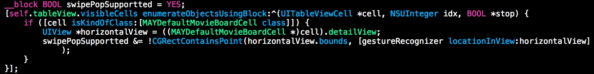
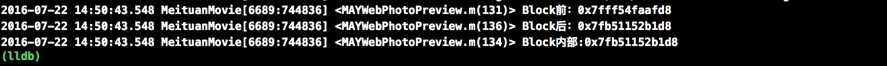
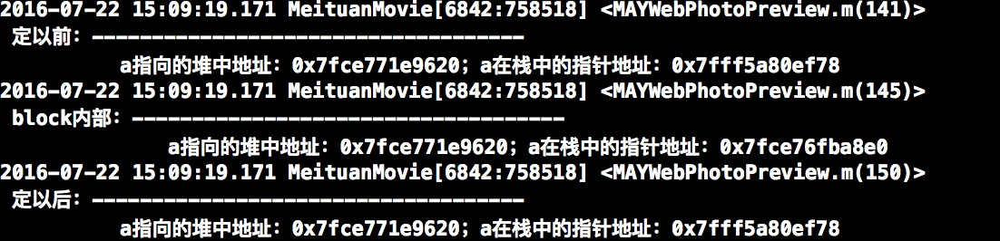
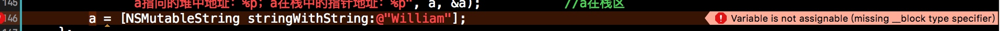

# Block
## Block内如何修改外部变量
默认情况下，在Block中访问的外部变量时直接复制过去的，即：写操作不影响原变量
如果想在Block内修改某一个外部变量，则需要Block外部在变量声明或定义前加`__block`关键字来标示
示例代码如下：
```
__block BOOL swipePopSupportted = YES;
    [self.tableView.visibleCells enumerateObjectsUsingBlock:^(UITableViewCell *cell, NSUInteger idx, BOOL *stop) {
        if ([cell isKindOfClass:[MAYDefaultMovieBoardCell class]]) {
            UIView *horizontalView = ((MAYDefaultMovieBoardCell *)cell).detailView;
            swipePopSupportted &= !CGRectContainsPoint(horizontalView.bounds, [gestureRecognizer locationInView:horizontalView]);
        }
    }];
```



代码中简单的增加一个关键字就好啦，但是具体的原因是什么呢？

>具体原因是：Block不允许修改外部变量的值，这里所说的外部变量的值指的是栈中指针的内存地址（外部变量实在栈中的）。__block的作用是将被Block所持有的“外部变量”从栈中内存地址移到了堆中，进而在Block内部可以修改外部变量的值。

__Block不允许修改外部变量的值__。Apple的设计初衷可能是考虑到Block的特殊性，Block也可以算作属于“函数”范畴，变量进入Block，实际就是已经改变了作用域。在几个作用域直接进行切换，如果不加上这样的限制，变量的可维护性大大降低。比如Block内声明了一个与外部同名的变量是否允许呢？
测试代码：

```
__block int testNum = 0;
    NSLog(@"Block前：%p", &testNum);
    void (^foo)(void) = ^{
        testNum = 1;
        NSLog(@"Block内部:%p", &testNum);
    };
    NSLog(@"Block后：%p", &testNum);
    foo();
```


从打印出的地址可以看出后两个内存地址是一样的，Block内部使用到的变量是被copy到堆区，Block内部对应的地址是堆地址，相应的可以得到Block后的地址也是堆地址
讲16进制的地址转换成10进制：
Block前：140734619103192
Block后：140415656440280
Block内部：140415656440280
中间相差318962662912个字节，大致297M的空间。因为堆地址是小于栈地址的，且在iOS中进程的栈区内存为1M，MAC中为8M，因此可以推出变量存在与堆区

>__block关键字的真正作用就是将Block捕获的外部变量在进入了Block区域后存放到了堆区

```
    NSMutableString *a = [NSMutableString stringWithString:@"Tom"];
    NSLog(@"\n 定以前：------------------------------------\n\
          a指向的堆中地址：%p；a在栈中的指针地址：%p", a, &a);               //a在栈区
    void (^foo2)(void) = ^{
        a.string = @"Jerry";
        NSLog(@"\n block内部：------------------------------------\n\
              a指向的堆中地址：%p；a在栈中的指针地址：%p", a, &a);           //a在栈区
//        a = [NSMutableString stringWithString:@"William"];
    };
    foo2();
    NSLog(@"\n 定以后：------------------------------------\n\
          a指向的堆中地址：%p；a在栈中的指针地址：%p", a, &a);               //a在栈区
```

这里的a是基本的对象类型，为引用类型。Block会对对象类型的指针进行copy，copy到堆中，但是该指针的内容不变。
在Block中修改的实际是a指向的堆中的内容
如果将注释的一样取消注释，则编译不通过

此时修改的a的内容，即栈的中内容
**Block不允许修改外部变量的值**，这里所指的外部变量是栈中指针的内容


