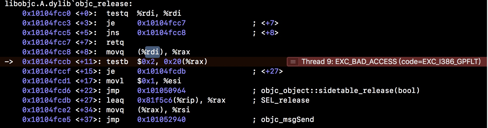

对OC线程安全的一些思考
# nonatomic & atomic

OC中对象的property默认的关键词有atomic、strong、readwrite
针对atomic这个关键词，大家平常可能都没怎么关注，下面来简单的说说这个

## nonatomic的一个误解 

首先从网上提供的一道网易面试题说起

```
@property (nonatomic, strong) NSString *target;
//....

dispatch_queue_t queue = dispatch_queue_create("parallel", DISPATCH_QUEUE_CONCURRENT);
for (int i = 0; i < 1000000 ; i++) {
    dispatch_async(queue, ^{
        self.target = [NSString stringWithFormat:@"----- %d ----\n",i];
    });
}

```
代码运行测试确实会发现crash，具体crash堆栈的数据显示如下


从图中看出是经典的`EXC_BAD_ACCESS`，是对已经释放的内存对象再次发发送消息
更改测试代码，具体如下
```
@property (nonatomic, strong) NSString *target;
//....
dispatch_queue_t queue = dispatch_queue_create("parallel", DISPATCH_QUEUE_CONCURRENT);
    for (int i =0; i < 100000; i+=1) {
        dispatch_async(queue, ^{
//            self.target = [NSString stringWithFormat:@"------ %@ ----\n", [@(i) stringValue]];
            self.target = @"1";
//            NSLog(@"---%@----\n", self.target);
        });
    }
```
下面通过更换队列为线性队列和加锁进行测试

```
dispatch_queue_t queue = dispatch_queue_create("parallel", DISPATCH_QUEUE_SERIAL);
    for (int i =0; i < 10000; i+=1) {
        dispatch_async(queue, ^{
            @synchronized(self){
                self.target = [NSString stringWithFormat:@"------ %@ ----\n", [@(i) stringValue]];
            }
//            self.target = [NSString stringWithFormat:@"------ %@ ----\n", [@(i) stringValue]];
//            self.target = @"1";
            NSLog(@"---%@----\n", self.target);
        });
    }

dispatch_queue_t queue = dispatch_queue_create("parallel", DISPATCH_QUEUE_CONCURRENT);
    for (int i =0; i < 10000; i+=1) {
        dispatch_async(queue, ^{
            @synchronized(self){
                self.target = [NSString stringWithFormat:@"------ %@ ----\n", [@(i) stringValue]];
            }
//            self.target = [NSString stringWithFormat:@"------ %@ ----\n", [@(i) stringValue]];
//            self.target = @"1";
            NSLog(@"---%@----\n", self.target);
        });
    }
```
通过测试串行队列和加锁代码，内存的使用量会增加较大，达到几十M

crash并没有发生，由代码的差异性可以看出crash应该和i息息相关.
通过第一次代码测试发现，每次crash的`i`值都比较大，再crash时候打印`i`相关的的数据`po i`，可以发现第一次的测试代码`i`已经被释放了

>异步发送任务，for循环已经走完了，代码块那的局部变量i已经注销了，而异步运行的`NSString format`仍然调用`i`，所以崩溃了
[网易OC多线程面试题](https://blog.csdn.net/wsgtc8080/article/details/77980331)
[网易面试题浅谈OC线程安全](https://www.jianshu.com/p/cec2a41aa0e7)

## nonatomic非线程安全原因

具体看看`runtime`的源码[`objc4-723`](https://opensource.apple.com/tarballs/objc4/)

```
id objc_getProperty(id self, SEL _cmd, ptrdiff_t offset, BOOL atomic) {
    if (offset == 0) {
        return object_getClass(self);
    }

    // Retain release world
    id *slot = (id*) ((char*)self + offset);
    if (!atomic) return *slot;
        
    // Atomic retain release world
    spinlock_t& slotlock = PropertyLocks[slot];
    slotlock.lock();
    id value = objc_retain(*slot);
    slotlock.unlock();
    
    // for performance, we (safely) issue the autorelease OUTSIDE of the spinlock.
    return objc_autoreleaseReturnValue(value);
}
```
根据源码可以看出，`getter`方法不会对property进行`retain`操作
当线程1执行完getter后，切换到线程2执行setter方法，setter会对oldvalue release，导致oldvalue被释放。在切换会线程1执行代码时，getter到的value时已经被释放的oldvalue，因此发生`EXC_BAD_ACCESS`的crash

```
static inline void reallySetProperty(id self, SEL _cmd, id newValue, ptrdiff_t offset, bool atomic, bool copy, bool mutableCopy) __attribute__((always_inline));

static inline void reallySetProperty(id self, SEL _cmd, id newValue, ptrdiff_t offset, bool atomic, bool copy, bool mutableCopy)
{
    if (offset == 0) {
        object_setClass(self, newValue);
        return;
    }

    id oldValue;
    id *slot = (id*) ((char*)self + offset);

    if (copy) {
        newValue = [newValue copyWithZone:nil];
    } else if (mutableCopy) {
        newValue = [newValue mutableCopyWithZone:nil];
    } else {
        if (*slot == newValue) return;
        newValue = objc_retain(newValue);
    }

    if (!atomic) {
        oldValue = *slot;
        *slot = newValue;
    } else {
        spinlock_t& slotlock = PropertyLocks[slot];
        slotlock.lock();
        oldValue = *slot;
        *slot = newValue;        
        slotlock.unlock();
    }

    objc_release(oldValue);
}

void objc_setProperty(id self, SEL _cmd, ptrdiff_t offset, id newValue, BOOL atomic, signed char shouldCopy) 
{
    bool copy = (shouldCopy && shouldCopy != MUTABLE_COPY);
    bool mutableCopy = (shouldCopy == MUTABLE_COPY);
    reallySetProperty(self, _cmd, newValue, offset, atomic, copy, mutableCopy);
}

void objc_setProperty_atomic(id self, SEL _cmd, id newValue, ptrdiff_t offset)
{
    reallySetProperty(self, _cmd, newValue, offset, true, false, false);
}

void objc_setProperty_nonatomic(id self, SEL _cmd, id newValue, ptrdiff_t offset)
{
    reallySetProperty(self, _cmd, newValue, offset, false, false, false);
}


void objc_setProperty_atomic_copy(id self, SEL _cmd, id newValue, ptrdiff_t offset)
{
    reallySetProperty(self, _cmd, newValue, offset, true, true, false);
}

void objc_setProperty_nonatomic_copy(id self, SEL _cmd, id newValue, ptrdiff_t offset)
{
    reallySetProperty(self, _cmd, newValue, offset, false, true, false);
}
```
一般情况下，getter执行后，会在外部对getter获取的属性进行retain，也就是调用objc_retain。但是也许就在getter发生之后，objc_retain之前其他线程执行了setter。这时候，就会导致objc_retain产生EXC_BAD_ACCESS，SDWebImage中就发生了类似的[crash](https://www.jianshu.com/p/b075bfd67899)，频繁调用SDWebImage，导致多线程切换。

如果property使用atomic会不会发生问题呢？
从源码可以看到，在获取到属性时，atomic下getter会立即对value进行retain，即使setter对oldValue release了。由于getter已经进行retain，属性不会立即释放。只有使用完成之后才会释放。所以atomic会可以保证属性的线程安全
	


