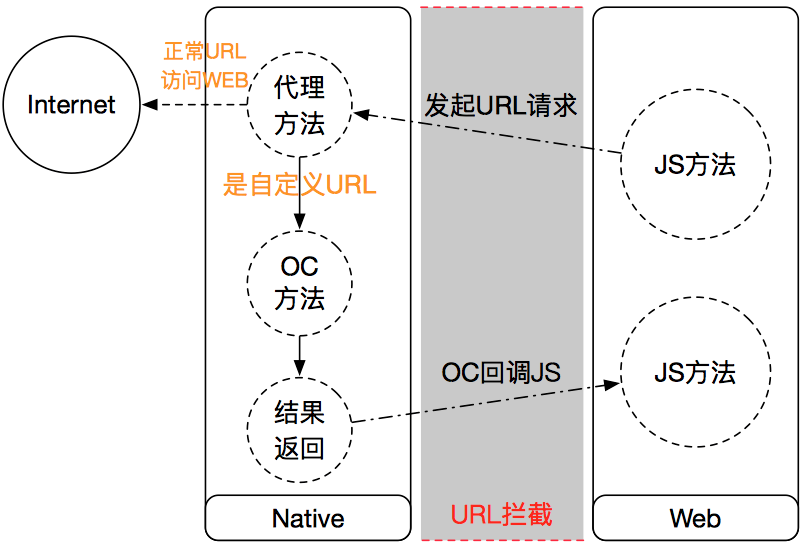

Native与Javascript交互

### Hybird App简要介绍
讲述Hybrid App，要先了解Native App和Web App的定义

* Native App是指针对不同的手机操作系统要采用不同的语言和框架进行开发，例如Java(Android), Objective-C(iOS)等；
* Web App即是HTML5 APP框架开发模式，使用HTML5,CSS3以及JavaScript以及服务器端语言来完成开发，Web App具有跨平台的优势。

根据定义显而易见得出两种开发模式的优劣势，Native App可以利用系统的所有特性，因此做出杰出的性能，然而每次功能升级都必须重新打包、审核再上架，平均浪费近两周的时间。而反观Web App就没有这样的问题，其缺点在于Web语言无法访问很多系统特性，性能不高。

鉴于二者各有的优劣势，顺理成章的衍生出了介于中间的开发模式Hybrid。其特点是在原生应用中嵌入一个浏览器组件，然后通过某种方式，让原生代码和网页能够双向通讯，结果就是可以在需要原生功能的时候使用原生功能，而适合放在网页端的部分就放在服务器上。某种程度上利用到了两者的优势。另一个优势就是，由于网页技术在iOS和Android上是一样的，所以网页的这部分也就天然可以跨平台了。

目前中国70%以上的Native APP都已经混合了Web技术，例如淘宝、大众点评、58同城、去哪儿等App都嵌入了大量的HTML5页面。让部分功能在WebView技术基础上缩短开发周期、实现灵活业务调整。


特性 | Native | Web | Hybrid
----- | ----- | ----- | ----
开发语言 | 原生语言(OC Java) | 网页语言(HTML+CSS+JS) | 网页语言+原生语言
跨平台性    | 低 | 高 | 高
设备访问能力 | 高 | 中 | 高
开发成本 | 高 | 低 | 中
用户体验 | 很好 | 差 | 较好
安装体验 | 高(商店) | 中(浏览器) | 高(商店)
升级灵活度 | 低 | 高 | 中
向后兼容 | 差 | 好 | 好
维护更新 | 复杂 | 简单 | 简单
高级图形 | 高 | 中 | 中
### native与JS相互调用的方式
目前主要的JS与OC相互调用方式主要有如下6种：

1. 在JS 中做一次URL跳转，然后在OC中拦截跳转。（这里分为UIWebView 和 WKWebView两种，UIWebView兼容iOS 6）
2. 利用WKWebView 的MessageHandler。
3. 利用系统库JavaScriptCore，来做相互调用。（iOS 7推出）
4. 利用第三方库WebViewJavascriptBridge。
5. 利用第三方cordova库，以前叫PhoneGap。（这是一个库平台的库）
6. 当下盛行的React Native。

由于目前平台库cordova和React Native依然处于发展中，学习成本高，可以在后续的学习中继续研究。

以下是对1-4中介绍的方式进行对比：

特性 | URL拦截 | MessageHandler | JavaScriptCore | WebViewJavascriptBridge
--- | ----- | ----- | ----- |----
优点 | 1.实现简单；2.适合接口少、轻量级的 | 1.不用拦截URL；2.参数传递简单；3.JS中的代码简单、规范 | JS调用Native方法时，参数的传递更方便 | 比URL拦截方式传递参数更方便
缺点 | 1.参数传递和解析复杂；2.安全性较低 | WKWebView中的方法，只适配iOS8	 | 适配iOS7 | 1.第三方库；2.做一次交互，需要执行的js与原生的交互步骤较多，至少有两次；3.需要花时间理解WebViewJavascriptBridge的原理和使用步骤；4.底层也是通过URL拦截的方式实现

>初步考虑，App兼容iOS7选择JavaScriptCore方式，App只兼容iOS8以上，可以采用WKWebView，并使用MessageHandler方式

### URL拦截

URL拦截的方式是用JS发起一个假的URL请求，然后利用UIWebView的代理方法拦截这次请求，解析URL的Scheme，根据Scheme来区分是否是调用OC原生方法还是正常的网页跳转，然后再做相应的处理。

#### UIWebView中实现

##### 创建UIWebview，加载本地HTML

```
    self.webView = [[UIWebView alloc] initWithFrame:self.view.frame];
    self.webView.delegate = self;
    NSURL *htmlURL = [[NSBundle mainBundle] URLForResource:@"index.html" withExtension:nil];
    NSURLRequest *request = [NSURLRequest requestWithURL:htmlURL];
    // 如果不想要webView 的回弹效果
    self.webView.scrollView.bounces = NO;
    // UIWebView 滚动的比较慢，这里设置为正常速度
    self.webView.scrollView.decelerationRate = UIScrollViewDecelerationRateNormal;
    [self.webView loadRequest:request];
    [self.view addSubview:self.webView];
```

##### 本地HTML
本地HTML中定义一个按钮，点击按钮触发调用js发起假的URL请求。

JS发起自定义Scheme的URL请求的方法： 
- JS将需要调用的OC函数，写在自定义URL中。 
- OC代码中通过拦截该Scheme来判断是否是自定义的URL。 
- 解析URL后面的参数，判断调用方法和调用参数。

```
<input type="button" value="获取定位" onclick="locationClick()" />
//发起假的URL请求
function loadURL(url) {
    var iFrame;
    iFrame = document.createElement("iframe");
    iFrame.setAttribute("src", url);
    iFrame.setAttribute("style", "display:none;");
    iFrame.setAttribute("height", "0px");
    iFrame.setAttribute("width", "0px");
    iFrame.setAttribute("frameborder", "0");
    document.body.appendChild(iFrame);
    // 发起请求后这个iFrame就没用了，所以把它从dom上移除掉
    iFrame.parentNode.removeChild(iFrame);
    iFrame = null;
}
function asyncAlert(content) {
    setTimeout(function(){
               alert(content);
               },1);
}
function locationClick() {
    loadURL("haleyAction://getLocation");
}
//OC回调js的函数
function setLocation(location) {
    asyncAlert(location);
    document.getElementById("returnValue").value = location;
}
```
在JS中调用OC方法的时，传参数到OC中，就像一个get请求一样，把参数放在后面：

```
function shareClick() {
    loadURL("haleyAction://shareClick?title=测试分享的标题&content=测试分享的内容&url=http://www.baidu.com");
}
```
所有的参数都在URL的query中，在OC中处理时，先通过&将字符串拆分，在通过=把参数拆分成key和实际的值。

##### OC中拦截URL
在UIWebView有一个代理方法，可以拦截到每一个链接的Request。return YES，webView就会加载这个链接；return NO，webView就不会加载这个连接。因此，需要在这个拦截的代理方法中处理自定义的URL，从中取出需要调用的OC函数名称。

这里通过判断scheme是否是自定义的，以此拦截掉自定义的URL请求。

```
#pragma mark - UIWebViewDelegate
- (BOOL)webView:(UIWebView *)webView shouldStartLoadWithRequest:(NSURLRequest *)request navigationType:(UIWebViewNavigationType)navigationType
{
    NSURL *URL = request.URL;
    NSString *scheme = [URL scheme];
    if ([scheme isEqualToString:@"haleyaction"]) {
        [self handleCustomAction:URL];
        return NO;
    }
    return YES;
}
```
##### OC回调JS

在UIWwbView处理自定义URL请求，以及通过UIWebVIew的方法回调JS代码：

```
#pragma mark - private method
- (void)handleCustomAction:(NSURL *)URL
{
    NSString *host = [URL host];
    if ([host isEqualToString:@"getLocation"]) {
        [self getLocation];
    }
}
- (void)getLocation
{
    // 获取位置信息
    //......
    // 将结果返回给JS
    // 将被调用的JS的函数名和参数写入字符串
    NSString *jsStr = [NSString stringWithFormat:@"setLocation('%@')",@"myNewLocation"];
    //回调JS代码
    [self.webView stringByEvaluatingJavaScriptFromString:jsStr];
}
```
>利用[webView stringByEvaluatingJavaScriptFromString:@"var arr = [3, 4, 'abc'];"];,可以往HMTL的JS环境中插入全局变量、JS方法等。

#### WKWebView实现方式
由于UIWebView比较耗内存，性能上不太好，而苹果在iOS8中推出了WKWebView。同样的用WKWebView也可以拦截URL，做JS与OC交互。WKWebView与UIWebView拦截URL的处理方式基本一样。除了代理方法和WKWebView的使用不太一样。

WKWebView的创建有几点不同：

1. 初始化多了configuration参数，当然这个参数也可以不传，直接使用默认的设置。
2. WKWebView的代理有两个navigationDelegate和UIDelegate。我们要拦截URL，就要通过navigationDelegate的一个代理方法来实现。如果在HTML中要使用alert等弹窗，就必须得实现UIDelegate的相应代理方法。
3. 在iOS9之前，WKWebView加载本地HTML会有一些问题。（不能加载本地HTML，或者部分CSS/本地图片加载不了等）

##### WKWebView的创建：
```
    WKWebViewConfiguration *configuration = [[WKWebViewConfiguration alloc] init];
    configuration.userContentController = [WKUserContentController new];
    WKPreferences *preferences = [WKPreferences new];
    preferences.javaScriptCanOpenWindowsAutomatically = YES;
    preferences.minimumFontSize = 30.0;
    configuration.preferences = preferences;
    self.webView = [[WKWebView alloc] initWithFrame:self.view.frame configuration:configuration];
    NSString *urlStr = [[NSBundle mainBundle] pathForResource:@"index.html" ofType:nil];
    NSURL *fileURL = [NSURL fileURLWithPath:urlStr];
    [self.webView loadFileURL:fileURL allowingReadAccessToURL:fileURL];
    self.webView.navigationDelegate = self;
    [self.view addSubview:self.webView];
```

##### WKWebView中拦截URL的方法：
```
#pragma mark - WKNavigationDelegate
- (void)webView:(WKWebView *)webView decidePolicyForNavigationAction:(WKNavigationAction *)navigationAction decisionHandler:(void (^)(WKNavigationActionPolicy))decisionHandler
{
    NSURL *URL = navigationAction.request.URL;
    NSString *scheme = [URL scheme];
    if ([scheme isEqualToString:@"haleyaction"]) {
        [self handleCustomAction:URL];
        decisionHandler(WKNavigationActionPolicyCancel);
        return;
    }
    decisionHandler(WKNavigationActionPolicyAllow);
}
```
>实现这个代理方法，必须得调用decisionHandler这个block，否则会导致app 崩溃。block参数是个枚举类型，WKNavigationActionPolicyCancel代表取消加载，相当于UIWebView的代理方法return NO的情况；WKNavigationActionPolicyAllow代表允许加载，相当于UIWebView的代理方法中return YES的情况。

##### WKWebView中OC调用JS方法：
```
- (void)getLocation
{
    // 获取位置信息
    // 将结果返回给js
    NSString *jsStr = [NSString stringWithFormat:@"setLocation('%@')",@"myNewLocation"];
    [self.webView evaluateJavaScript:jsStr completionHandler:^(id _Nullable result, NSError * _Nullable error) {
        NSLog(@"%@----%@",result, error);
    }];
}
```
>evaluateJavaScript:completionHandler:没有返回值，JS 执行成功还是失败会在completionHandler 中返回。所以使用这个API 就可以避免执行耗时的JS，或者alert 导致界面卡住的问题。

### MessageHandle

利用WKWebView的新特性MessageHandler来实现JS调用原生方法。

#### MessageHandler的好处
1. 在JS中写起来简单，不用再用创建URL的方式那么麻烦了。
2. JS传递参数更方便。使用拦截URL的方式传递参数，只能把参数拼接在后面，如果遇到要传递的参数中有特殊字符，如&、=、?等，必须得转换，否则参数解析肯定会出错。
3. 使用MessageHandler就可以避免特殊字符引起的问题。

例如传递的url是这样的：

```
http://www.baidu.com/share/openShare.htm?share_uuid=shdfxdfdsfsdf&name=1234556
```
使用拦截URL的JS调用方式：

```
loadURL("firstClick://shareClick?title=分享的标题&content=分享的内容&url=链接地址&imagePath=图片地址"); 
```
将上面的url 放入链接地址这里后，难以区分share_uuid是其他参数，还是url里附带的参数。

#### 实现原理
WKWebView初始化时，有一个参数叫configuration，它是WKWebViewConfiguration类型的参数，而WKWebViewConfiguration有一个属性叫userContentController，它又是WKUserContentController类型的参数。WKUserContentController对象有一个方法- addScriptMessageHandler:name:，我把这个功能简称为MessageHandler。

- addScriptMessageHandler:name:有两个参数，第一个参数是userContentController的代理对象，第二个参数是JS里发送postMessage的对象。

所以要使用MessageHandler功能，就必须要实现WKScriptMessageHandler协议。

在该API的描述里可以看到在JS中的使用方法：

```
window.webkit.messageHandlers.<name>.postMessage(<messageBody>)
//其中<name>，就是上面方法里的第二个参数`name`。
//例如我们调用API的时候第二个参数填@"Share"，那么在JS里就是:
//window.webkit.messageHandlers.Share.postMessage(<messageBody>)
//<messageBody>是一个键值对，键是body，值可以有多种类型的参数。
// 在`WKScriptMessageHandler`协议中，我们可以看到mssage是`WKScriptMessage`类型，有一个属性叫body。
// 而注释里写明了body 的类型：Allowed types are NSNumber, NSString, NSDate, NSArray, NSDictionary, and NSNull.
```
#### OC中配置MessageHandler
MessageHandler的使用：
 
* 创建WKWebViewConfiguration对象，配置各个API对应的MessageHandler。

```
WKWebViewConfiguration *configuration = [[WKWebViewConfiguration alloc] init];
    configuration.userContentController = [WKUserContentController new];
    [configuration.userContentController addScriptMessageHandler:self name:@"ScanAction"];
    [configuration.userContentController addScriptMessageHandler:self name:@"Location"];
    [configuration.userContentController addScriptMessageHandler:self name:@"Share"];
    WKPreferences *preferences = [WKPreferences new];
    preferences.javaScriptCanOpenWindowsAutomatically = YES;
    preferences.minimumFontSize = 40.0;
    configuration.preferences = preferences;
```

* 创建WKWebView

```
self.webView = [[WKWebView alloc] initWithFrame:self.view.frame configuration:configuration];
    NSString *urlStr = [[NSBundle mainBundle] pathForResource:@"index.html" ofType:nil];
    NSURL *fileURL = [NSURL fileURLWithPath:urlStr];
    [self.webView loadFileURL:fileURL allowingReadAccessToURL:fileURL];
    self.webView.navigationDelegate = self;
    self.webView.UIDelegate = self;
    [self.view addSubview:self.webView];
```
* 实现协议方法。 
这里实现了两个协议< WKUIDelegate,WKScriptMessageHandler >，WKUIDelegate是因为需要在JS中弹出alert。WKScriptMessageHandler是用来处理JS调用OC方法的请求。

先看实现协议方法的示例代码：

```
#pragma mark - WKScriptMessageHandler
- (void)userContentController:(WKUserContentController *)userContentController didReceiveScriptMessage:(WKScriptMessage *)message
{
//    message.body  --  Allowed types are NSNumber, NSString, NSDate, NSArray,NSDictionary, and NSNull.
    if ([message.name isEqualToString:@"ScanAction"]) {
        NSLog(@"扫一扫");
    } else if ([message.name isEqualToString:@"Location"]) {
        [self getLocation];
    } else if ([message.name isEqualToString:@"Share"]) {
        [self shareWithParams:message.body];
    }
}
```
WKScriptMessage有两个关键属性name和body。

因为已经给每一个OC方法取了一个name，那么就可以根据name来区分执行不同的方法。body中存着JS要给OC传的参数。关于参数body的解析，举一个body中放字典的例子，解析JS调用OC实现分享的参数

```
- (void)shareWithParams:(NSDictionary *)tempDic
{
    if (![tempDic isKindOfClass:[NSDictionary class]]) {
        return;
    }
    // 分解参数
    NSString *title = [tempDic objectForKey:@"title"];
    NSString *content = [tempDic objectForKey:@"content"];
    NSString *url = [tempDic objectForKey:@"url"];
    // 在这里执行分享的操作
    // ......
    // 将分享结果返回给js
    NSString *jsStr = [NSString stringWithFormat:@"shareResult('%@','%@','%@')",title,content,url];
    [self.webView evaluateJavaScript:jsStr completionHandler:^(id _Nullable result, NSError * _Nullable error) {
        NSLog(@"%@----%@",result, error);
    }];
}
```
#### JS中的使用
处理HTML中JS调用，JS部分代码进行改动：

```
// 传null
function scanClick() {
    window.webkit.messageHandlers.ScanAction.postMessage(null);
}
// 传字典              
function shareClick() {
    window.webkit.messageHandlers.Share.postMessage({title:'测试分享的标题',content:'测试分享的内容',url:'http://www.baidu.com'});
}
// 传字符串
function playSound() { 
    window.webkit.messageHandlers.PlaySound.postMessage('shake_sound_male.wav');
}
// 传数组
function colorClick() {
    window.webkit.messageHandlers.Color.postMessage([67,205,128,0.5]);
}
```

#### OC调用JS

这里使用WKWebView实现OC调用JS方法跟WKWebView使用URL拦截是一样的，还是利用 
`evaluateJavaScript:completionHandler:`方法：

```
// 将分享结果返回给js
    NSString *jsStr = [NSString stringWithFormat:@"shareResult('%@','%@','%@')",title,content,url];
    [self.webView evaluateJavaScript:jsStr completionHandler:^(id _Nullable result, NSError * _Nullable error) {
        NSLog(@"%@----%@",result, error);
    }];
```
### JavaScriptCore


JavaScriptCore自iOS7之后出现，用Objective-C把WebKit的JavaScript引擎封装了一下，提供了简单快捷的方式与JavaScript交互。

特点：
 
* JS中调用OC方法更简单，参数的传递也更加简单 
* 支持iOS7以上

#### JavaScriptCore说明

JavaScriptCore是一个iOS7新添加的框架，使用前需要先导入JavaScriptCore.framework。在JavaScriptCore.h中可以看到，该框架主要的类有五个：

* JSVirtualMachine直译是JS虚拟机，也就是说JavaScript是在一个虚拟的环境中执行，而JSVirtualMachine为其执行提供底层资源。
* JSContext是为JavaScript的执行提供运行环境，所有的JavaScript的执行都必须在JSContext环境中。JSContext也管理JSVirtualMachine中对象的生命周期。每一个JSValue对象都要强引用关联一个JSContext。当与某JSContext对象关联的所有JSValue释放后，JSContext也会被释放。
* JSValue都是通过JSContext返回或者创建的，并没有构造方法。JSValue包含了每一个JavaScript类型的值，通过JSValue可以将Objective-C中的类型转换为JavaScript中的类型，也可以将JavaScript中的类型转换为Objective-C中的类型。
* JSManagedValue主要用途是解决JSValue对象在Objective-C堆上的安全引用问题。把JSValue保存进Objective-C堆对象中是不正确的，这很容易引发循环引用，而导致JSContext不能释放。但是不常用。
* JSExport是一个协议类，但是该协议并没有任何属性和方法。可以自定义一个协议类，继承自JSExport。无论在JSExport里声明的属性、实例方法还是类方法，继承的协议都会自动的提供给任何JavaScript代码。因此，只需要在自定义的协议类中，添加上属性和方法就可以了。
#### 实现步骤

1. 创建UIWebView，并加载本地HTML。（同上） 
2. JS代码，JS的调用更简单

```
function shareClick() {
    //直接通过share()调用原生OC方法
    share('测试分享的标题','测试分享的内容','url=http://www.baidu.com');
}
function shareResult(channel_id,share_channel,share_url) {
    var content = channel_id+","+share_channel+","+share_url;
    asyncAlert(content);
    document.getElementById("returnValue").value = content;
}
function locationClick() {
    //直接通过getLocation()调用原生OC方法
    getLocation();
}
function setLocation(location) {
    asyncAlert(location);
    document.getElementById("returnValue").value = location;
}
```
##### OC中添加JS将要调用的原生OC方法
在HMTL加载成功的回调方法` (void)webViewDidFinishLoad:(UIWebView *)webView`中添加要调用的原生OC方法:

```
#pragma mark - UIWebViewDelegate
- (void)webViewDidFinishLoad:(UIWebView *)webView
{
    NSLog(@"webViewDidFinishLoad");
    [self addCustomActions];
}
```

此处，将所有要添加的功能方法，集中到addCustomActions方法中添加：

```
#pragma mark - private method
- (void)addCustomActions
{
    // 创建JSContext
    JSContext *context = [self.webView valueForKeyPath:@"documentView.webView.mainFrame.javaScriptContext"];
    [self addScanWithContext:context];
    [self addLocationWithContext:context];
}
```

再实现每一个小功能：
```
- (void)addShareWithContext:(JSContext *)context
{
    __weak typeof(self) weakSelf = self;
    // 创建函数
    context[@"share"] = ^() {
        NSArray *args = [JSContext currentArguments];
        if (args.count < 3) {
            return ;
        }
        NSString *title = [args[0] toString];
        NSString *content = [args[1] toString];
        NSString *url = [args[2] toString];
        // 在这里执行分享的操作...
        // 将分享结果返回给js
        NSString *jsStr = [NSString stringWithFormat:@"shareResult('%@','%@','%@')",title,content,url];
        [[JSContext currentContext] evaluateScript:jsStr];
    };
}
```
>  * JS要调用的原生OC方法，可以在viewDidLoad webView被创建后就添加好，但最好是在网址加载成功后再添加，以避免无法预料的乱入Bug。
* block中的执行环境是在子线程中。奇怪的是竟然可以更新部分UI，例如给view设置背景色，调用webView执行js等，但是弹出原生alertView就会在控制台报子线程操作UI的错误信息。
* 避免循环引用，因为block会持有外部变量，而JSContext也会强引用它所有的变量，因此在block中调用self时，要用__weak转一下。而且在block内不要使用外部的context以及JSValue，都会导致循环引用。如果要使用context可以使用[JSContext currentContext]。当然我们可以将JSContext和JSValue当做block的参数传进去，这样就可以使用啦。

##### OC调用JS方法 

OC调用JS方法有多种方式，首先介绍使用JavaScriptCore框架的方式。 
###### 方式1 
使用JSContext的方法- evaluateScript，可以实现OC调用JS方法。 
下面是一个调用JS中payResult方法的示例代码：
```
NSString *jsStr = [NSString stringWithFormat:@"payResult('%@')",@"支付成功"];
[[JSContext currentContext] evaluateScript:jsStr];
```
###### 方式2 
使用JSValue的方法- callWithArguments，也可以实现OC调用JS方法。 
下面这个示例代码依然是调用JS中的payResult:

```
JSContext *context = [self.webView valueForKeyPath:@"documentView.webView.mainFrame.javaScriptContext"];
[context[@"payResult"] callWithArguments:@[@"支付弹窗"]];
```

当然，如果是在执行原生OC方法之后，想要在OC执行完操作后，将结果回调给JS时，可以这样写：

```
- (void)addPayActionWithContext:(JSContext *)context
{
    context[@"payAction"] = ^() {
        NSArray *args = [JSContext currentArguments];
        if (args.count < 4) {
            return ;
        }
        NSString *orderNo = [args[0] toString];
        NSString *channel = [args[1] toString];
        long long amount = [[args[2] toNumber] longLongValue];
        NSString *subject = [args[3] toString];
        // 支付操作
        NSLog(@"orderNo:%@---channel:%@---amount:%lld---subject:%@",orderNo,channel,amount,subject);
        // 将支付结果返回给js
        [[JSContext currentContext][@"payResult"] callWithArguments:@[@"支付成功"]];
    };
}
```
###### 方式3 
同上，利用UIWebView的API：

```
NSString *jsStr = [NSString stringWithFormat:@"payResult('%@')",@"支付成功"];
[weakSelf.webView stringByEvaluatingJavaScriptFromString:jsStr];
```

### WebViewJavascriptBridge

WebViewJavascriptBridge是一个第三方的JS与OC交互的库，在UIWebView和WKWebView下都可以使用，但是使用方法略有不同。UIWebView中使用WebViewJavascriptBridge来达到JS与OC互相调用的目的，WKWebView使用的是WKWebViewJavascriptBridge。下面以UIWebVIew为例。

利用WebViewJavascriptBridge来实现JS与OC的交互的优点：

- 获取参数时，更方便一些，如果参数中有一些特殊符号或者url带参数，能够很好的解析。

也有一些缺点：

- 做一次交互，需要执行的js 与原生的交互步骤较多，至少有两次。
- 需要花较多的时间，理解WebViewJavascriptBridge的原理和使用步骤。

##### UIWebView中的实现

###### 添加第三方库 
###### 创建UIWebView 

在viewDidLoad中创建：

```
    self.webView = [[UIWebView alloc] initWithFrame:self.view.frame];
    [self.view addSubview:self.webView];
    NSURL *htmlURL = [[NSBundle mainBundle] URLForResource:@"index.html" withExtension:nil];
    NSURLRequest *request = [NSURLRequest requestWithURL:htmlURL];
    // UIWebView 滚动的比较慢，这里设置为正常速度
    self.webView.scrollView.decelerationRate = UIScrollViewDecelerationRateNormal;
    [self.webView loadRequest:request];
```
> 这里不需要为UIWebView设置代理，因为在创建WebViewJavascriptBridge的时候，UIWebView的代理已经被赋值给了WebViewJavascriptBridge。

###### 创建WebViewJavascriptBridge 

因为WebViewJavascriptBridge实例，在控制中多个地方用到，因此最好定义一个property或者实例变量存起来。

```
_webViewBridge = [WebViewJavascriptBridge bridgeForWebView:self.webView];
// {setWebViewDelegate}这个方法，可以将UIWebView的代理，从_webViewBridge中再传递出来。
// 所以如果你要在控制器中实现UIWebView的代理方法时，添加下面这样代码，否则可以不写。
[_webViewBridge setWebViewDelegate:self];
```
在bridgeForWebView:中可以看到UIWebView的代理设置

```
+ (instancetype)bridgeForWebView:(WVJB_WEBVIEW_TYPE*)webView {
    WebViewJavascriptBridge* bridge = [[self alloc] init];
    [bridge _platformSpecificSetup:webView];
    return bridge;
}
// 上面方法调用了这个方法
- (void) _platformSpecificSetup:(WVJB_WEBVIEW_TYPE*)webView {
    _webView = webView;
    _webView.delegate = self;
    _base = [[WebViewJavascriptBridgeBase alloc] init];
    _base.delegate = self;
}
```

###### 注册JS要调用的OC函数

```
#pragma mark - private method
- (void)registerNativeFunctions
{
    [self registShareFunction];
    [self registLocationFunction];
}
- (void)registShareFunction
{
    // 所有JS需要调用的原生功能都要先用registerHandler注册一下
    [_webViewBridge registerHandler:@"shareClick" handler:^(id data, WVJBResponseCallback responseCallback) {
        // data的类型与JS中传的参数有关
        NSDictionary *tempDic = data;
        // 在这里执行分享的操作
        NSString *title = [tempDic objectForKey:@"title"];
        NSString *content = [tempDic objectForKey:@"content"];
        NSString *url = [tempDic objectForKey:@"url"];
        // 将分享的结果返回到JS中
        NSString *result = [NSString stringWithFormat:@"分享成功:%@,%@,%@",title,content,url];
        responseCallback(result);
    }];
}
```
`(void)registerHandler:(NSString *)handlerName handler:(WVJBHandler)handler`该方法有两个参数：第一个参数handlerName，是对这个功能起的一个别名；第二个参数handler，是个block，也就是Native实现的功能。JS要调用的Native实现其实就是block的{}内的代码功能。

###### HTML中JS代码的书写（JS调用OC） 
由于WebViewJavascriptBridge也是拦截URL来实现的调用原生功能，所以实现方式和拦截URL的方式差不多。

HTML中有一个必须要添加的JS方法，然后需要自动调用一次该方法。该方法是：

```
function setupWebViewJavascriptBridge(callback) {
    if (window.WebViewJavascriptBridge) { return callback(WebViewJavascriptBridge); }
    if (window.WVJBCallbacks) { return window.WVJBCallbacks.push(callback); }
    window.WVJBCallbacks = [callback];
    var WVJBIframe = document.createElement('iframe');
    WVJBIframe.style.display = 'none';
    WVJBIframe.src = 'wvjbscheme://__BRIDGE_LOADED__';
    document.documentElement.appendChild(WVJBIframe);
    setTimeout(function() { document.documentElement.removeChild(WVJBIframe) }, 0)
}
```
上面这个方法的参数是一个function，这个方法的作用主要是在第一次加载HTML的时候起作用，目的是加载一次`wvjbscheme://__BRIDGE_LOADED__`，来触发往HTML中注册一些已经写好的JS方法。

添加完`setupWebViewJavascriptBridge`方法，需要在JS中主动调用一次该方法：

```
setupWebViewJavascriptBridge(function(bridge) {
     bridge.registerHandler('testJavascriptHandler', function(data, responseCallback) {
        alert('JS方法被调用:'+data);
        responseCallback('js执行过了');
     })
})
```
Native需要调用的JS功能，也是需要先注册，然后再执行。如果Native需要调用的JS功能有多个，那么这些功能都要在这里先注册，注册之后才能够被Native调用。

JS中这个方法的作用:
> * 首先调用setupWebViewJavascriptBridge，第一次执行的时候，由于window.WebViewJavascriptBridge和window.WVJBCallbacks都不存在，所以会继续往下执行，将参数callback（它是一个function）装进数组赋值给window.WVJBCallbacks。 
* js 支持动态添加属性并赋值，这里window.WVJBCallbacks = [callback];就是动态添加属性，并赋值。另外js中的全局变量都可以使用window.xxxx来调用；动态添加的属性也可以不加window.，直接使用。
* WebViewJavascriptBridge 帮助JS调用Native的URL有两种，一种是wvjbscheme://__BRIDGE_LOADED__；而另一种是wvjbscheme://__WVJB_QUEUE_MESSAGE__。前者只有在调用setupWebViewJavascriptBridge的时候执行一次，一般来说这个URL如果没有页面应该只会执行一次。第二种URL所有js调用Native功能时，都会使用到。
* 在拦截到自定义的URL时，WebViewJavascriptBridge分了三种情况，如果是wvjbscheme://__BRIDGE_LOADED__，就往HMTL中注入已经写好的js，这个js在WebViewJavascriptBridge_JS中；如果是wvjbscheme://__WVJB_QUEUE_MESSAGE__,那就利用stringByEvaluatingJavaScriptFromString，取回调用js中callHandler传进去的参数。然后再从WebViewJavascriptBridge之前保存的Native方法对应的block，调用对应的block。
###### JS调用Native 
利用之前注入的JS方法callHandler就可以调用Native功能：

```
function shareClick() {
    var params = {'title':'测试分享的标题','content':'测试分享的内容','url':'http://www.baidu.com'};
    WebViewJavascriptBridge.callHandler('shareClick',params,function(response) {
         alert(response);
        document.getElementById("returnValue").value = response;
     });
}
```
这里callHandler前的WebViewJavascriptBridge，其实就是上一步注入到JS中的代码中，动态创建属性，动态赋值的属性。如下代码片段可以在WebViewJavascriptBridge_JS中找到。

```
window.WebViewJavascriptBridge = {
  registerHandler: registerHandler,
  callHandler: callHandler,
  disableJavscriptAlertBoxSafetyTimeout: disableJavscriptAlertBoxSafetyTimeout,
  _fetchQueue: _fetchQueue,
  _handleMessageFromObjC: _handleMessageFromObjC
 };
```

###### Native主动调用js功能 
Native主动调用js的功能时，需要先在js中为要调用的功能注册一个别名。

* js注册Native要调用的功能

```
setupWebViewJavascriptBridge(function(bridge) {
     bridge.registerHandler('testJSFunction', function(data, responseCallback) {
        alert('JS方法被调用:'+data);
        responseCallback('js执行过了');
     })
    // 注册其他的功能
    //bridge.regsiterHandler.....
})
```
* Native调用功能的别名handlerName

```
//    // 如果不需要参数，不需要回调，使用这个
//    [_webViewBridge callHandler:@"testJSFunction"];
//    // 如果需要参数，不需要回调，使用这个
//    [_webViewBridge callHandler:@"testJSFunction" data:@"一个字符串"];
    // 如果既需要参数，又需要回调，使用这个
    [_webViewBridge callHandler:@"testJSFunction" data:@"一个字符串" responseCallback:^(id responseData) {
        NSLog(@"调用完JS后的回调：%@",responseData);
    }];
```
## 参考文档

[iOS中JS与OC相互调用的方式](https://www.zybuluo.com/Sweetfish/note/501575)
[WKWebView使用小结](https://www.zybuluo.com/xifenglang-33250/note/623860)


