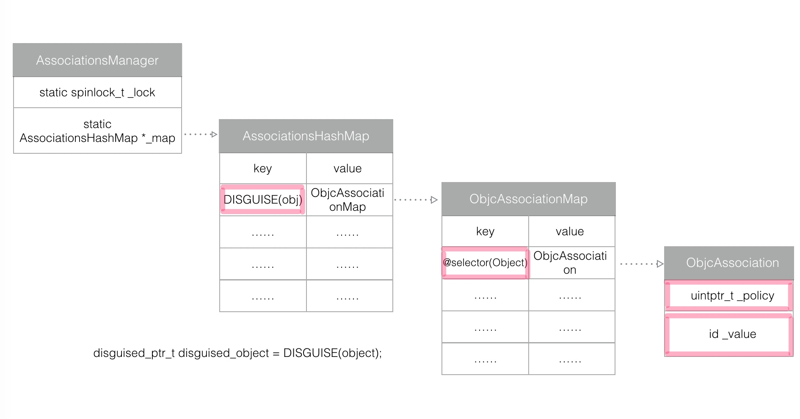

Runtime 详解

# Runtime的使用

* 实现多继承Multiple Inheritance
* Method Swizzling
* Aspect Oriented Programming
* Isa Swizzling
* Associated Object关联对象
* 动态的添加方法
* NSCoding的自动归档和自动解档
* 字典和模型的相互转换

### Multiple Inheritance
采用的方法有
（1）
`- (id)forwardingTargetForSelector:(SEL)aSelector`
和
（2）
`- (void)forwardInvocation:(NSInvocation *)anInvocation`
`- (NSMethodSignature *)methodSignatureForSelector:(SEL)aSelector`

### Method Swizzling
[Method Swizzling](http://nshipster.com/method-swizzling/)

```
void swizzleMethod(Class class, SEL originalSelector, SEL swizzledSelector)  
{
    // the method might not exist in the class, but in its superclass
    Method originalMethod = class_getInstanceMethod(class, originalSelector);
    Method swizzledMethod = class_getInstanceMethod(class, swizzledSelector);

    // class_addMethod will fail if original method already exists
    BOOL didAddMethod = class_addMethod(class, originalSelector, method_getImplementation(swizzledMethod), method_getTypeEncoding(swizzledMethod));

    // the method doesn’t exist and we just added one
    if (didAddMethod) {
        class_replaceMethod(class, swizzledSelector, method_getImplementation(originalMethod), method_getTypeEncoding(originalMethod));
    } else {
        method_exchangeImplementations(originalMethod, swizzledMethod);
    }
}
```
针对方法中使用的`class_addMethod`进行一层保护性措施。如果这个类中没有实现`originalSelector`，但其父类实现了，那`class_getInstanceMethod`会返回父类的方法。这样`method_exchangeImplementations`替换的是父类的方法，这不是我们想要的，所以需要先尝试的添加`originalSelector`，如果已经存在，在用`method_exchangeImplementations`把原方法的实现跟新的方法实现进行交换

> 在进行Swizzling的时候，我们需要用class_addMethod先进行判断一下原有类中是否有要替换的方法的实现。

>如果class_addMethod返回NO，说明当前类中有要替换方法的实现，所以可以直接进行替换，调用method_exchangeImplementations即可实现Swizzling。

>如果class_addMethod返回YES，说明当前类中没有要替换方法的实现，我们需要在父类中去寻找。这个时候就需要用到method_getImplementation去获取class_getInstanceMethod里面的方法实现。然后再进行class_replaceMethod来实现Swizzling

### Associated Object关联对象
[Associated Objects详细用例](http://nshipster.com/associated-objects/)

```
@interface NSObject (AssociatedObject)
@property (nonatomic, strong) id associatedObject;
@end
@implementation NSObject (AssociatedObject)
@dynamic associatedObject;

- (void)setAssociatedObject:(id)object {
     objc_setAssociatedObject(self, @selector(associatedObject), object, OBJC_ASSOCIATION_RETAIN_NONATOMIC);
}

- (id)associatedObject {
    return objc_getAssociatedObject(self, @selector(associatedObject));
}
```
在category中动态添加属性主要涉及到一下子三个方法

```
OBJC_EXPORT void objc_setAssociatedObject(id object, const void *key, id value, objc_AssociationPolicy policy)
    __OSX_AVAILABLE_STARTING(__MAC_10_6, __IPHONE_3_1);

OBJC_EXPORT id objc_getAssociatedObject(id object, const void *key)
    __OSX_AVAILABLE_STARTING(__MAC_10_6, __IPHONE_3_1);

OBJC_EXPORT void objc_removeAssociatedObjects(id object)
    __OSX_AVAILABLE_STARTING(__MAC_10_6, __IPHONE_3_1);
这个方法是移除对象中所有关联对象，如果想移除指定的key对象，使用objc_setAssociatedObject方法将对应的key设置成nil即可
```
在日常使用中设置key的方式大致有以下三种
```
static char AssociatedObjectKey = "AssociatedKey";
static const void *AssociatedKey = "AssociatedKey";
@selector(associatedKey)
```
推荐使用`@selector(associatedKey)`这种简便的方式
方法中有个`objc_AssociationPolicy`类型参数，是一个枚举，分别和property相应的attribute对应

Behavior | @property Equivalent | Description
-------- | ------------| ---------
OBJC_ASSOCIATION_ASSIGN | @property(assign) or @property (unsafe_unretained) | Specifies a weak reference to the associated object
OBJC_ASSOCIATION_RETAIN_NONATOMIC | @property (nonatomic, strong) | Specifies a strong reference to the associated object, and that the association is not made atomically
OBJC_ASSOCIATION_COPY_NONATOMIC | @property (nonatomic, copy) | Specifies that the associated object is copied, and that the association is not made atomically
OBJC_ASSOCIATION_RETAIN | @property (atomic, strong) | Specifies a strong reference to the associated object, and that the association is made atomically
OBJC_ASSOCIATION_COPY | @property (atomic, copy) | Specifies that the associated object is copied, and that the association is made atomically

> Weak associations to objects made with OBJC_ASSOCIATION_ASSIGN are not zero weak references, but rather follow a behavior similar to unsafe_unretained, which means that one should be cautious when accessing weakly associated objects within an implementation
> According to the Deallocation Timeline described in WWDC 2011, Session 322 (~36:00), associated objects are erased surprisingly late in the object lifecycle, in object_dispose(), which is invoked by NSObject -dealloc

#### 源码分析
```
void objc_setAssociatedObject(id object, const void *key, id value, 
                         objc_AssociationPolicy policy) 
{
    objc_setAssociatedObject_non_gc(object, key, value, policy);
}

void objc_setAssociatedObject_non_gc(id object, const void *key, id value, objc_AssociationPolicy policy) {
    _object_set_associative_reference(object, (void *)key, value, policy);
}

void _object_set_associative_reference(id object, void *key, id value, uintptr_t policy) {
    // retain the new value (if any) outside the lock.
    ObjcAssociation old_association(0, nil);
    id new_value = value ? acquireValue(value, policy) : nil;
    {
        AssociationsManager manager;
        AssociationsHashMap &associations(manager.associations());
        disguised_ptr_t disguised_object = DISGUISE(object);
        if (new_value) {
            // break any existing association.
            AssociationsHashMap::iterator i = associations.find(disguised_object);
            if (i != associations.end()) {
                // secondary table exists
                ObjectAssociationMap *refs = i->second;
                ObjectAssociationMap::iterator j = refs->find(key);
                if (j != refs->end()) {
                    old_association = j->second;
                    j->second = ObjcAssociation(policy, new_value);
                } else {
                    (*refs)[key] = ObjcAssociation(policy, new_value);
                }
            } else {
                // create the new association (first time).
                ObjectAssociationMap *refs = new ObjectAssociationMap;
                associations[disguised_object] = refs;
                (*refs)[key] = ObjcAssociation(policy, new_value);
                object->setHasAssociatedObjects();
            }
        } else {
            // setting the association to nil breaks the association.
            AssociationsHashMap::iterator i = associations.find(disguised_object);
            if (i !=  associations.end()) {
                ObjectAssociationMap *refs = i->second;
                ObjectAssociationMap::iterator j = refs->find(key);
                if (j != refs->end()) {
                    old_association = j->second;
                    refs->erase(j);
                }
            }
        }
    }
    // release the old value (outside of the lock).
    if (old_association.hasValue()) ReleaseValue()(old_association);
}
```


通过查看源码，`objc_setAssociatedObject`最终调用的是`_object_set_associative_reference`方法。方法的具体的逻辑分为两个部分;
全局变量manager，得到一个`AssociationsHashMap`，存储每个Object添加的属性对应一个`ObjectAssociationMap`，最后根据key去查找到对应的value
```
class AssociationsManager {
    static spinlock_t _lock;
    static AssociationsHashMap *_map;
public:
    AssociationsManager()   { _lock.lock(); }
    ~AssociationsManager()  { _lock.unlock(); }

    AssociationsHashMap &associations() {
        if (_map == NULL)
            _map = new AssociationsHashMap();
        return *_map;
    }
};
```
在`AssociationsManager`中有一个spinlock类型的自旋锁lock。保证每次只有一个线程对`AssociationManager`进行操作，保证线程安全。`AssociationsHashMap`是一张哈希表。
`AssociationsHashMap`里面的key是`disguised_ptr_t`
```
disguised_ptr_t disguised_object = DISGUISE(object);
```
通过调用`DISFGUISE（）`方法获取object地址的指针。拿到disguised_object后，通过这个key获取`AssociationsHashMap`哈希表里面的value值。value值为`ObjcAssociationMap`表的首地址
在`ObjcAssociationsMap`表中，key值是set方法里面传过来的形参`const void *key`，value值为`ObjcAssociation`对象
总结一句话是：`objc_setAssociatedObject`方法的目的就是在这两张哈希表中存储对应的键值对。
（1）new_value不为nil
	先初始化一个`AssociationsManager`，获取唯一的保存关联对象的哈希表`AssociationsHashMap`，然后在`AssociationsHashMap`里面去查找object地址的指针。
	如果找到了，则存在第二张表`ObjcAssociationsMap`，在`ObjcAssociationsMap`查找对应object的key；若在`ObjcAssociationsMap`中找到对应的`ObjcAssociation`对象，那就更新它的值，没有找到则新建一个`ObjcAssociation`对象，放入第二张表`ObjcAssociationsMap`；
	如果没找到，则目前不存在`ObjcAssociationsMap`，需要新建一个`ObjcAssociationsMap`，初始化一个`ObjcAssociation`，存储对应的键值对到`ObjcAssociationsMap`中，并把`ObjcAssociationsMap`存储到`AssociationsHashMap`中。
	其中`setHasAssociatedObjects`方法，改变的是`isa_t`结构体中的第二个标志位`has_assoc`的值
	以上是new_value不为nil的情况。其实只要记住上面那2张表的结构，这个`objc_setAssociatedObject`的过程就是更新 / 新建 表中键值对的过程
（2）new_value为nil的情况
	当new_value为nil的情况，就是要移除关联对象。找到对应两张表中的对应键值，并调用`erase()`方法，即可删除对应的关联对象
	
```
id objc_getAssociatedObject(id object, const void *key) 
{
    return objc_getAssociatedObject_non_gc(object, key);
}

id objc_getAssociatedObject_non_gc(id object, const void *key) {
    return _object_get_associative_reference(object, (void *)key);
}

id _object_get_associative_reference(id object, void *key) {
    id value = nil;
    uintptr_t policy = OBJC_ASSOCIATION_ASSIGN;
    {
        AssociationsManager manager;
        AssociationsHashMap &associations(manager.associations());
        disguised_ptr_t disguised_object = DISGUISE(object);
        AssociationsHashMap::iterator i = associations.find(disguised_object);
        if (i != associations.end()) {
            ObjectAssociationMap *refs = i->second;
            ObjectAssociationMap::iterator j = refs->find(key);
            if (j != refs->end()) {
                ObjcAssociation &entry = j->second;
                value = entry.value();
                policy = entry.policy();
                if (policy & OBJC_ASSOCIATION_GETTER_RETAIN) ((id(*)(id, SEL))objc_msgSend)(value, SEL_retain);
            }
        }
    }
    if (value && (policy & OBJC_ASSOCIATION_GETTER_AUTORELEASE)) {
        ((id(*)(id, SEL))objc_msgSend)(value, SEL_autorelease);
    }
    return value;
}
```
`objc_getAssociatedObject`方法就是遍历`AssociationsHashMap`哈希表和`ObjcAssociationMap`表的所有键值对，找到对应的`ObjcAssociation`对象，找到了就返回`ObjcAssociation`对象，没有就返回nil

```
void objc_removeAssociatedObjects(id object) 
{
#if SUPPORT_GC
    if (UseGC) {
        auto_zone_erase_associative_refs(gc_zone, object);
    } else 
#endif
    {
        if (object && object->hasAssociatedObjects()) {
            _object_remove_assocations(object);
        }
    }
}
void _object_remove_assocations(id object) {
    vector< ObjcAssociation,ObjcAllocator<ObjcAssociation> > elements;
    {
        AssociationsManager manager;
        AssociationsHashMap &associations(manager.associations());
        if (associations.size() == 0) return;
        disguised_ptr_t disguised_object = DISGUISE(object);
        AssociationsHashMap::iterator i = associations.find(disguised_object);
        if (i != associations.end()) {
            // copy all of the associations that need to be removed.
            ObjectAssociationMap *refs = i->second;
            for (ObjectAssociationMap::iterator j = refs->begin(), end = refs->end(); j != end; ++j) {
                elements.push_back(j->second);
            }
            // remove the secondary table.
            delete refs;
            associations.erase(i);
        }
    }
    // the calls to releaseValue() happen outside of the lock.
    for_each(elements.begin(), elements.end(), ReleaseValue());
}
```
在删除对象的所有关联对象之前，会先判断object的`isa_t`中的第二位`has_assoc`的值，当object存在并且`object->hasAssociatedObjects()`为1的时候，才回去调用`_object_remove_associations`方法
`_object_remove_associations`方法就是删除object对应的`ObjcAssociationMap`表，即删除所有关联对象。
在`AssociationsHashMap`中遍历查找，找到对应的`ObjcAssociationMap`后，将其所有的`ObjcAssociation`对象都存储在一个数组`elements`里面，然后调用`association.erase()`删除第二张表。在遍历`elements`数组，把`ObjcAssocation`对象依次释放

### 动态的添加方法
+resolveInstanceMethod


### 综述

```
//获取cls类对象所有成员ivar结构体
Ivar *class_copyIvarList(Class cls, unsigned int *outCount)
//获取cls类对象name对应的实例方法结构体
Method class_getInstanceMethod(Class cls, SEL name)
//获取cls类对象name对应类方法结构体
Method class_getClassMethod(Class cls, SEL name)
//获取cls类对象name对应方法imp实现
IMP class_getMethodImplementation(Class cls, SEL name)
//测试cls对应的实例是否响应sel对应的方法
BOOL class_respondsToSelector(Class cls, SEL sel)
//获取cls对应方法列表
Method *class_copyMethodList(Class cls, unsigned int *outCount)
//测试cls是否遵守protocol协议
BOOL class_conformsToProtocol(Class cls, Protocol *protocol)
//为cls类对象添加新方法
BOOL class_addMethod(Class cls, SEL name, IMP imp, const char *types)
//替换cls类对象中name对应方法的实现
IMP class_replaceMethod(Class cls, SEL name, IMP imp, const char *types)
//为cls添加新成员
BOOL class_addIvar(Class cls, const char *name, size_t size, uint8_t alignment, const char *types)
//为cls添加新属性
BOOL class_addProperty(Class cls, const char *name, const objc_property_attribute_t *attributes, unsigned int attributeCount)
//获取m对应的选择器
SEL method_getName(Method m)
//获取m对应的方法实现的imp指针
IMP method_getImplementation(Method m)
//获取m方法的对应编码
const char *method_getTypeEncoding(Method m)
//获取m方法参数的个数
unsigned int method_getNumberOfArguments(Method m)
//copy方法返回值类型
char *method_copyReturnType(Method m)
//获取m方法index索引参数的类型
char *method_copyArgumentType(Method m, unsigned int index)
//获取m方法返回值类型
void method_getReturnType(Method m, char *dst, size_t dst_len)
//获取方法的参数类型
void method_getArgumentType(Method m, unsigned int index, char *dst, size_t dst_len)
//设置m方法的具体实现指针
IMP method_setImplementation(Method m, IMP imp)
//交换m1，m2方法对应具体实现的函数指针
void method_exchangeImplementations(Method m1, Method m2)
//获取v的名称
const char *ivar_getName(Ivar v)
//获取v的类型编码
const char *ivar_getTypeEncoding(Ivar v)
//设置object对象关联的对象
void objc_setAssociatedObject(id object, const void *key, id value, objc_AssociationPolicy policy)
//获取object关联的对象
id objc_getAssociatedObject(id object, const void *key)
//移除object关联的对象
void objc_removeAssociatedObjects(id object)
```
这些API看上去不好记，其实使用的时候不难，关于方法操作的，一般都是method开头，关于类的，一般都是class开头的，其他的基本都是objc开头的，剩下的就看代码补全的提示，看方法名基本就能找到想要的方法了。当然很熟悉的话，可以直接打出指定方法，也不会依赖代码补全。

还有一些关于协议相关的API以及其他一些不常用，但是也可能用到的，就需要查看
[Objective-C Runtime官方API文档](https://developer.apple.com/reference/objectivec/objective_c_runtime?preferredLanguage=occ)


