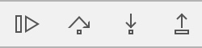
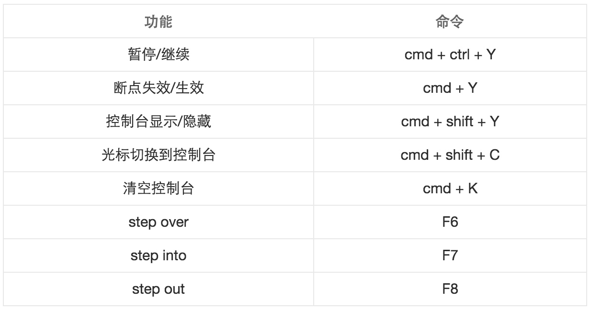

# 开发调试

[TOC]

## LLDB
### LLDB语法

```
<command> [<subcommand> [<subcommand>...]] <action> [-options [option-value]] [argument [argument...]]
```
* \<command>(命令)和\<subcommand>(子命令)：LLDB调试命令的名称。命令和子命令按层级结构来排列：一个命令对象为跟随其的子命令对象创建一个上下文，子命令又为其子命令创建一个上下文，依此类推。
* \<action>：执行命令的操作
* \<options>：命令选项
* \<argument>：命令的参数
* []：表示命令是可选的，可以有也可以没有
例如：

```
breakpoint set -n main
```
语法分析如下：

* command: breakpoint 表示断点命令
* action: set 表示设置断点
* option: -n 表示根据方法name设置断点
* argument: main 表示方法名为main

### ~/.lldbinit
LLDB有了一个启动时加载的文件~/.lldbinit，每次启动都会加载。所以一些初始化的事儿，我们可以写入~/.lldbinit中，比如给命令定义别名等。但是由于这时候程序还没有真正运行，也有部分操作无法在里面玩，比如设置断点
例如：reveal 的命令别名的设置

### LLDB命令
#### expression

```
expression <cmd-options> -- <expr>
```
1. \<cmd-options>：命令选项，一般情况下使用默认的即可，不需要特别标明。
2. --: 命令选项结束符，表示所有的命令选项已经设置完毕，如果没有命令选项，--可以省略
3. \<expr>: 要执行的表达式

* 执行某个表达式。 我们在代码运行过程中，可以通过执行某个表达式来动态改变程序运行的轨迹。 假如我们在运行过程中，突然想把self.view颜色改成红色，看看效果。我们不必写下代码，重新run，只需暂停程序，用expression改变颜色，再刷新一下界面，就能看到效果
* 将返回值输出。 也就是说我们可以通过expression来打印东西。 假如我们想打印self.view

```
  // 改变颜色
(lldb) expression -- self.view.backgroundColor = [UIColor redColor]
  // 刷新界面
(lldb) expression -- (void)[CATransaction flush]
(lldb) expression -- self.view
(UIView *) $1 = 0x00007fe322c18a10
```
#### p & print & call
p、print、call是我们比较常用的三个命令，它们都是是`expression --`（-- 表示不再接受命令选项）的别名

* print：打印某个东西，可以是变量和表达式
* p：可以看作是print的简写
* call：调用某个方法

```
(lldb) expression -- self.view
(UIView *) $5 = 0x00007fb2a40344a0
(lldb) p self.view
(UIView *) $6 = 0x00007fb2a40344a0
(lldb) print self.view
(UIView *) $7 = 0x00007fb2a40344a0
(lldb) call self.view
(UIView *) $8 = 0x00007fb2a40344a0
(lldb) e self.view
(UIView *) $9 = 0x00007fb2a40344a0
```
>根据唯一匹配原则，如果你没有自己添加特殊的命令别名。e也可以表示expression的意思。原始命令默认没有命令选项，所以e也能带给你同样的效果

#### po
OC的对象都是引用类型的，打印出来的是对象的指针，而不是对象本身。如果我们想打印对象，需要使用命令选项`-o`，`po`就是`expression -o`的别名

```
(lldb) expression -- self.view
(UIView *) $13 = 0x00007fb2a40344a0
(lldb) expression -o -- self.view
<UIView: 0x7fb2a40344a0; frame = (0 0; 375 667); autoresize = W+H; layer = <CALayer: 0x7fb2a4018c80>>
(lldb) po self.view
<UIView: 0x7fb2a40344a0; frame = (0 0; 375 667); autoresize = W+H; layer = <CALayer: 0x7fb2a4018c80>>
```
#### thread
##### thread backtrace
`thread backtrace`(别名`bt`)用于把线程的堆栈打印出来。

```
thread backtrace [-c <count>] [-s <frame-index>] [-e <boolean>]
```
thread backtrace后面的均是命令选项：

* -c：设置打印堆栈的帧数(frame)
* -s：设置从哪个帧(frame)开始打印
* -e：是否显示额外的回溯

用例：
当发生crash我们就用使用`thread backtrace`查看堆栈信息

```
(lldb) thread backtrace
* thread #1: tid = 0xdd42, 0x000000010afb380b libobjc.A.dylib`objc_msgSend + 11, queue = 'com.apple.main-thread', stop reason = EXC_BAD_ACCESS (code=EXC_I386_GPFLT)
    frame #0: 0x000000010afb380b libobjc.A.dylib`objc_msgSend + 11
  * frame #1: 0x000000010aa9f75e TLLDB`-[ViewController viewDidLoad](self=0x00007fa270e1f440, _cmd="viewDidLoad") + 174 at ViewController.m:23
    frame #2: 0x000000010ba67f98 UIKit`-[UIViewController loadViewIfRequired] + 1198
    frame #3: 0x000000010ba682e7 UIKit`-[UIViewController view] + 27
    frame #4: 0x000000010b93eab0 UIKit`-[UIWindow addRootViewControllerViewIfPossible] + 61
    frame #5: 0x000000010b93f199 UIKit`-[UIWindow _setHidden:forced:] + 282
    frame #6: 0x000000010b950c2e UIKit`-[UIWindow makeKeyAndVisible] + 42
```
##### thread return
Debug的时候，可能由于某种原因，不想让代码执行某个method或者直接返回一个值，就可以使用`thread return`命令

```
thread return [<expr>]
```
thread return可以接受一个表达式，调用命令之后直接从当前的frame返回表达式的值
e.g:有一个someMethod方法，默认情况下是返回YES。我们想要让他返回NO。我们只需在方法的开始位置加一个断点，当程序中断的时候，输入命令即可:

```
(lldb) thread return NO
```
##### c & n & s & finish


* c/ continue/ thread continue: 这三个命令效果都等同于上图中第一个按钮的。表示程序继续运行
* n/ next/ thread step-over: 这三个命令效果等同于上图第二个按钮。表示单步运行
* s/ step/ thread step-in: 这三个命令效果等同于上图第三个按钮。表示进入某个方法
* finish/ step-out: 这两个命令效果等同于第四个按钮。表示直接走完当前方法，返回到上层frame

##### thread其他不常用命令
thread 相关的还有其他一些不常用的命令，这里就简单介绍一下即可，如果需要了解更多，可以使用命令help thread查阅

* thread jump: 直接让程序跳到某一行。由于ARC下编译器实际插入了不少retain，release命令。跳过一些代码不执行很可能会造成对象内存混乱发生crash。
* thread list: 列出所有的线程
* thread select: 选择某个线程
* thread until: 传入一个line的参数，让程序执行到这行的时候暂停
* thread info: 输出当前线程的信息

#### frame
在`thread backtrace`命令中我们看到frame的输出。仔细观察，这些frame和左边的红框里的堆栈是一致。平时我们看到的左边的堆栈就是frame

##### frame variable
`frame variabel`可以打印出当前frame的所有变量值

```
(lldb) frame variable
(ViewController *) self = 0x00007fa158526e60
(SEL) _cmd = "text:"
(BOOL) ret = YES
(int) a = 3
//打印指定变量
(lldb) frame variable self->_string
(NSString *) self->_string = nil
```
不过frame variable只接受变量作为参数，不接受表达式，也就是说我们无法使用`frame variable self.string`，因为self.string是调用string的getter方法。所以一般打印指定变量，我更喜欢用p或者po。
##### frame相关其他不常用命令

* frame info 查看当前frame的信息
* frame select 选择某个frame

e.g:

```
(lldb) frame info
frame #0: 0x0000000101bf87d5 TLLDB`-[ViewController text:](self=0x00007fa158526e60, _cmd="text:", ret=YES) + 37 at ViewController.m:38

(lldb) frame select 1
frame #1: 0x0000000101bf872e TLLDB`-[ViewController viewDidLoad](self=0x00007fa158526e60, _cmd="viewDidLoad") + 78 at ViewController.m:23
   20      
   21      - (void)viewDidLoad {
   22          [super viewDidLoad];
-> 23          [self text:YES];
   24          NSLog(@"1");
   25          NSLog(@"2");
   26          NSLog(@"3");
```
#### breakpoint
Debug调试过程中用到的最多的就是断点相关的知识
##### breakpoint set
`breakpoint set`用于设置断点
 
* 使用`-n`根据方法名设置断点
	e.g: 给所有类中的viewWillAppear:设置一个断点:
	
	```
	(lldb) breakpoint set -n viewWillAppear:
    Breakpoint 13: 33 locations.
	```
* 使用`-f`指定文件
 e.g: 给ViewController.m文件中的viewDidLoad设置断点：
 
 ```
  (lldb) breakpoint set -f ViewController.m -n viewDidLoad
    Breakpoint 22: where = TLLDB`-[ViewController viewDidLoad] + 20 at ViewController.m:22, address = 0x000000010272a6f4
 ```
这里需要注意，如果方法未写在文件中（比如写在category文件中，或者父类文件中），指定文件之后，将无法给这个方法设置断点。
* 使用`-c`设置条件断点
	e.g: text:方法接受一个ret的参数，我们想让ret == YES的时候程序中断：

```
(lldb) breakpoint set -n text: -c ret == YES
Breakpoint 7: where = TLLDB`-[ViewController text:] + 30 at ViewController.m:37, address = 0x0000000105ef37ce
```
* 使用`-o`设置单次断点
	e.g: 如果断点我们只想让他中断一次
	
```
(lldb) breakpoint set -n text: -o
'breakpoint 3': where = TLLDB`-[ViewController text:] + 30 at ViewController.m:37, address = 0x000000010b6f97ce
```
	
##### breakpoint command

###### breakpoint command add
`break command add`给断点添加命令的命令
e.g: 假设需要在ViewController的viewDidLoad中查看self.view的值 我们首先给-[ViewController viewDidLoad]添加一个断点

```
(lldb) breakpoint set -n "-[ViewController viewDidLoad]"
//添加成功之后，这个breakpoint的id为3
'breakpoint 3': where = TLLDB`-[ViewController viewDidLoad] + 20 at ViewController.m:23, address = 0x00000001055e6004
```
 断点添加成功后给它增加一个命令： po self.view
 
 ```
 (lldb) breakpoint command add -o "po self.view" 3
 ```
 -o完整写法是--one-liner，表示增加一条命令。3表示对id为3的breakpoint增加命令。 添加完命令之后，每次程序执行到这个断点就可以自动打印出self.view的值了
 
 ```
 (lldb) breakpoint command add 3
Enter your debugger command(s).  Type 'DONE' to end.
> frame variable
> continue
> DONE
 ```
输入breakpoint command add 3对断点3增加命令。它会让你输入增加哪些命令，输入’DONE’表示结束。这时候你就可以输入多条命令了
> 多次对统一断点添加命令，后面命令会将前面命令覆盖

###### breakpoint command list
`breakpoint command list`查看断点已有命令的命令
e.g: 查看断点3的已有命令

```
(lldb) breakpoint command list 3
'breakpoint 3':
    Breakpoint commands:
      frame variable
      continue
```
###### breakpoint command delete
`breakpoint command delete`用于删除某个断点的命令
e.g: 将断点3中的命令删除

```
(lldb) breakpoint command delete 3
(lldb) breakpoint command list 3
Breakpoint 3 does not have an associated command.
```
##### breakpoint list
`breakpoint list`查看已有的断点

```
(lldb) breakpoint list
Current breakpoints:
4: name = '-[ViewController viewDidLoad]', locations = 1, resolved = 1, hit count = 0
  4.1: where = TLLDB`-[ViewController viewDidLoad] + 20 at ViewController.m:23, address = 0x00000001055e6004, resolved, hit count = 0
```
##### breakpoint disable/enable
设置某个断点失效或有效

```
(lldb) breakpoint disable 4
1 breakpoints disabled.
(lldb) breakpoint enable 4
1 breakpoints enabled.
```
##### breakpoint delete
删除某个断点或所有断点

```
(lldb) breakpoint delete 4
1 breakpoints deleted; 0 breakpoint locations disabled.
(lldb) breakpoint delete 
About to delete all breakpoints, do you want to do that?: [Y/n] y
All breakpoints removed. (1 breakpoint)

//直接删除某个断点
(lldb) breakpoint delete -f
All breakpoints removed. (1 breakpoint)
```
>实际平时我们真正使用breakpoint命令反而比较少，因为Xcode已经内置了断点工具。我们可以直接在代码上打断点，可以在断点工具栏里面查看编辑断点，这比使用LLDB命令方便很多。不过了解LLDB相关命令可以让我们对断点理解更深刻。 如果你想了解怎么使用Xcode设置断点，可以阅读这篇文章[《Xcode中断点的威力》](http://www.cocoachina.com/industry/20130701/6514.html)

#### watchpoint
breakpoint有一个孪生兄弟watchpoint。如果说breakpoint是对方法生效的断点，watchpoint就是对地址生效的断点
如果我们想要知道某个属性什么时候被篡改了，我们该怎么办呢？有人可能会说对setter方法打个断点不就行了么？但是如果更改的时候没调用setter方法呢？ 这时候最好的办法就是用watchpoint。我们可以用他观察这个属性的地址。如果地址里面的东西改变了，就让程序中断

##### watchpoint set
`watchpoint set`命令用于添加一个watchpoint。只要这个地址中的内容变化了，程序就会中断

###### watchpoint set variable
一般情况下，要观察变量或者属性，使用`watchpoint set variable`命令即可 
e.g: 观察self->_string

```
(lldb) watchpoint set variable self->_string
Watchpoint created: Watchpoint 1: addr = 0x7fcf3959c418 size = 8 state = enabled type = w
    watchpoint spec = 'self->_string'
    new value: 0x0000000000000000
```
watchpoint set variable传入的是变量名。需要注意的是，这里不接受方法，所以不能使用watchpoint set variable self.string，因为self.string调用的是string的getter方法

###### watchpoint set expression
`watchpoint set expression`观察某个地址

```
(lldb) p &_model
(Modek **) $3 = 0x00007fe0dbf23280
(lldb) watchpoint set expression 0x00007fe0dbf23280
Watchpoint created: Watchpoint 1: addr = 0x7fe0dbf23280 size = 8 state = enabled type = w
    new value: 0
```
先去的某个变量的地址，然后设置watchpoint

##### watchpoint command
跟breakpoint类似，在watchpoint中也可以添加命令

###### watchpoint command add

```
//先设置一个watchpoint
(lldb) watchpoint set variable _string
Watchpoint created: Watchpoint 1: addr = 0x7fe4e1444760 size = 8 state = enabled type = w
    watchpoint spec = '_string'
    new value: 0x0000000000000000
//对watchpoint添加命令
watchpoint command add -o 'bt' 1
//也可以一次添加多条命令
(lldb) watchpoint command add 1
Enter your debugger command(s).  Type 'DONE' to end.
> bt
> continue
> DONE
```
###### watchpoint command list
`watchpoint command list` 列出某个watchpoint所有的command

```
(lldb) watchpoint command list 1
Watchpoint 1:
    watchpoint commands:
      bt
      continue
```
###### watchpoint command delete
删除watchpoint的command

```
(lldb) watchpoint command delete 1
(lldb) watchpoint command list 1
Watchpoint 1 does not have an associated command.
```

##### watchpoint list
查看当前所有watchpoint，可以使用watchpoint list:

```
(lldb) watchpoint list
Number of supported hardware watchpoints: 4
Current watchpoints:
Watchpoint 1: addr = 0x7fe9f9f28e30 size = 8 state = enabled type = w
    watchpoint spec = '_string'
    old value: 0x0000000000000000
    new value: 0x000000010128e0d0
``` 
##### watchpoint disable/enable
是某个watchpoint失效，或有效

```
(lldb) watchpoint disable 1
1 watchpoints disabled.

(lldb) watchpoint enable 1
1 watchpoints enabled.
```
##### watchpoint delete
删除某个watchpoint

```
(lldb) watchpoint delete 1
1 watchpoints deleted.
(lldb) watchpoint list
Number of supported hardware watchpoints: 4
No watchpoints currently set.
// 删除所有的watchpoint
(lldb) watchpoint delete 
About to delete all watchpoints, do you want to do that?: [Y/n] y
All watchpoints removed. (2 watchpoints)
```
#### target

##### target modules lookup(image lookup)
对于target这个命令，我们用得最多的可能就是target modules lookup。由于LLDB给target modules取了个别名image，所以这个命令我们又可以写成image lookup

###### image lookup -address
当有一个地址，想查找这个地址具体对应的文件位置，可以使用`image lookup --address`，简写为`image lookup -a`
e.g: 当发生一个crash

```
2015-12-17 14:51:06.301 TLLDB[25086:246169] *** Terminating app due to uncaught exception 'NSRangeException', reason: '*** -[__NSArray0 objectAtIndex:]: index 1 beyond bounds for empty NSArray'
*** First throw call stack:
(
    0   CoreFoundation                      0x000000010accde65 __exceptionPreprocess + 165
    1   libobjc.A.dylib                     0x000000010a746deb objc_exception_throw + 48
    2   CoreFoundation                      0x000000010ac7c395 -[__NSArray0 objectAtIndex:] + 101
    3   TLLDB                               0x000000010a1c3e36 -[ViewController viewDidLoad] + 86
    4   UIKit                               0x000000010b210f98 -[UIViewController loadViewIfRequired] + 1198
    5   UIKit                               0x000000010b2112e7 -[UIViewController view] + 27
```
可以看到是由于-[__NSArray0 objectAtIndex:]:超出边界而导致的crash，但是objectAtIndex:的代码到底在哪儿呢？

```
(lldb) image lookup -a 0x000000010a1c3e36
      Address: TLLDB[0x0000000100000e36] (TLLDB.__TEXT.__text + 246)
      Summary: TLLDB`-[ViewController viewDidLoad] + 86 at ViewController.m:32
```
###### image lookup -name
当想查找一个方法或者符号的信息，比如所在文件位置等。我们可以使用`image lookup --name`，简写为`image lookup -n`
e.g: 刚刚遇到的真问题，某个第三方SDK用了一个我们项目里原有的第三方库，库里面对NSDictionary添加了category。也就是有2个class对NSDictionary添加了名字相同的category，项目中调用自己的category的地方实际走到了第三方SDK里面去了。最大的问题是，这2个同名category方法行为并不一致，导致出现bug

现在问题来了，怎么寻找到底是哪个第三方SDK？方法完全包在.a里面。

```
(lldb) image lookup -n dictionaryWithXMLString:
2 matches found in /Users/jiangliancheng/Library/Developer/Xcode/DerivedData/VideoIphone-aivsnqmlwjhxapdlvmdmrubbdxpq/Build/Products/Debug-iphoneos/BaiduIphoneVideo.app/BaiduIphoneVideo:
        Address: BaiduIphoneVideo[0x00533a7c] (BaiduIphoneVideo.__TEXT.__text + 5414908)
        Summary: BaiduIphoneVideo`+[NSDictionary(SAPIXmlDictionary) dictionaryWithXMLString:] at XmlDictionary.m
         Module: file = "/Users/jiangliancheng/Library/Developer/Xcode/DerivedData/VideoIphone-aivsnqmlwjhxapdlvmdmrubbdxpq/Build/Products/Debug-iphoneos/BaiduIphoneVideo.app/BaiduIphoneVideo", arch = "armv7"
    CompileUnit: id = {0x00000000}, file = "/Users/jiangliancheng/Development/Work/iOS_ShareLib/SharedLib/Srvcs/BDPassport4iOS/BDPassport4iOS/SAPI/Extensive/ThirdParty/XMLDictionary/XmlDictionary.m", language = "Objective-C"
       Function: id = {0x23500000756}, name = "+[NSDictionary(SAPIXmlDictionary) dictionaryWithXMLString:]", range = [0x005a6a7c-0x005a6b02)
       FuncType: id = {0x23500000756}, decl = XmlDictionary.m:189, clang_type = "NSDictionary *(NSString *)"
         Blocks: id = {0x23500000756}, range = [0x005a6a7c-0x005a6b02)
      LineEntry: [0x005a6a7c-0x005a6a98): /Users/jiangliancheng/Development/Work/iOS_ShareLib/SharedLib/Srvcs/BDPassport4iOS/BDPassport4iOS/SAPI/Extensive/ThirdParty/XMLDictionary/XmlDictionary.m
         Symbol: id = {0x0000f2d5}, range = [0x005a6a7c-0x005a6b04), name="+[NSDictionary(SAPIXmlDictionary) dictionaryWithXMLString:]"
       Variable: id = {0x23500000771}, name = "self", type = "Class", location =  [sp+32], decl = 
       Variable: id = {0x2350000077e}, name = "_cmd", type = "SEL", location =  [sp+28], decl = 
       Variable: id = {0x2350000078b}, name = "string", type = "NSString *", location =  [sp+24], decl = XmlDictionary.m:189
       Variable: id = {0x23500000799}, name = "data", type = "NSData *", location =  [sp+20], decl = XmlDictionary.m:192
        Address: BaiduIphoneVideo[0x012ee160] (BaiduIphoneVideo.__TEXT.__text + 19810016)
        Summary: BaiduIphoneVideo`+[NSDictionary(XMLDictionary) dictionaryWithXMLString:] at XMLDictionary.m
         Module: file = "/Users/jiangliancheng/Library/Developer/Xcode/DerivedData/VideoIphone-aivsnqmlwjhxapdlvmdmrubbdxpq/Build/Products/Debug-iphoneos/BaiduIphoneVideo.app/BaiduIphoneVideo", arch = "armv7"
    CompileUnit: id = {0x00000000}, file = "/Users/wingle/Workspace/qqlive4iphone/iphone_4.0_fabu_20150601/Common_Proj/mobileTAD/VIDEO/Library/Third Party/XMLDictionary/XMLDictionary.m", language = "Objective-C"
       Function: id = {0x79900000b02}, name = "+[NSDictionary(XMLDictionary) dictionaryWithXMLString:]", range = [0x01361160-0x0136119a)
       FuncType: id = {0x79900000b02}, decl = XMLDictionary.m:325, clang_type = "NSDictionary *(NSString *)"
         Blocks: id = {0x79900000b02}, range = [0x01361160-0x0136119a)
      LineEntry: [0x01361160-0x01361164): /Users/wingle/Workspace/qqlive4iphone/iphone_4.0_fabu_20150601/Common_Proj/mobileTAD/VIDEO/Library/Third Party/XMLDictionary/XMLDictionary.m
         Symbol: id = {0x0003a1e9}, range = [0x01361160-0x0136119c), name="+[NSDictionary(XMLDictionary) dictionaryWithXMLString:]"
       Variable: id = {0x79900000b1e}, name = "self", type = "Class", location =  r0, decl = 
       Variable: id = {0x79900000b2c}, name = "_cmd", type = "SEL", location =  r1, decl = 
       Variable: id = {0x79900000b3a}, name = "string", type = "NSString *", location =  r2, decl = XMLDictionary.m:325
       Variable: id = {0x79900000b4a}, name = "data", type = "NSData *", location =  r2, decl = XMLDictionary.m:327
```
具体我们关注file一行就OK
可以清晰的看到，LLDB给我们找出来了这个方法的位置。 当然这个命令也可以找到方法的其他相关信息，比如参数等

###### image lookup –type
当想查看一个类型的时候，可以使用`image lookup --type`，简写为`image lookup -t`

```
(lldb) image lookup -t Model
Best match found in /Users/jiangliancheng/Library/Developer/Xcode/DerivedData/TLLDB-beqoowskwzbttrejseahdoaivpgq/Build/Products/Debug-iphonesimulator/TLLDB.app/TLLDB:
id = {0x30000002f}, name = "Model", byte-size = 32, decl = Modek.h:11, clang_type = "@interface Model : NSObject{
    NSString * _bb;
    NSString * _cc;
    NSString * _name;
}
@property ( getter = name,setter = setName:,readwrite,nonatomic ) NSString * name;
@end
"
```
可以看到，LLDB把Model这个class的所有属性和成员变量都打印了出来，当我们想了解某个类的时候，直接使用`image lookup -t`即可

##### target stop-hook
`target stop-hook`命令就是让你可以在每次stop的时候去执行一些命令

>target stop-hook只对breakpoint和watchpoint的程序stop生效，直接点击Xcode上的pause或者debug view hierarchy不会生效

###### target stop-hook add & display

假如我们想在每次程序stop的时候，都用命令打印当前frame的所有变量。我们可以添加一个stop-hook

```
(lldb) target stop-hook add -o "frame variable"
Stop hook #4 added.
```
target stop-hook add表示添加stop-hook，-o的全称是--one-liner，表示添加一条命令
大多情况下，我们在stop的时候可能想要做的是打印一个东西。正常情况我们需要用target stop-hook add -o "p xxx"，LLDB提供了一个更简便的命令display

```
(lldb) target stop-hook add -o "p self.view"
(lldb) display self.view
```
>也可以用display来执行某一个命令。p,e,expression是等效的

###### target stop-hook list
`target stop-hook list`列出所有添加的stop-hook

###### target stop-hook delete & undisplay
使用target stop-hook delete可以删除stop-hook，如果你觉得这个命令有点长，懒得敲。你也可以用undisplay

```
(lldb) target stop-hook delete 4
(lldb) undisplay 5
```
用target stop-hook delete和undisplay分别删除了id为4和5的stop-hook

###### target stop-hook disable/enable

```
//使某个stop-hook失效
(lldb) target stop-hook disable 8
//使所有stop-hook失效
(lldb) target stop-hook disable
//使某个stop-hook有效
(lldb) target stop-hook enable 8
//使所有stop-hook有效
(lldb) target stop-hook enable
```
#### Extension
若想打印某个view的frame等变量（默认情况下是答应不出来的）

```
(lldb) p self.view.frame
error: property 'frame' not found on object of type 'UIView *'
error: 1 errors parsing expression
(lldb) e @import UIKit
(lldb) p self.view.frame
(CGRect) $0 = (origin = (x = 0, y = 0), size = (width = 375, height = 667))
```
由于每次run Xcode，LLDB的东西都会被清空。所以每次run你都需要在LLDB中输入e @import UIKit才能使用这个方便的功能，有点麻烦呀！
可以给UIApplicationMain设置一个断点，在断点中添加执行e @import UIKit。
这种方法非常方便，不用自己输入了，但是断点我们可能会误删，而且断点是对应工程的。换一个工程又得重新打一个这样的断点。还是有点麻烦。有没有更简便的方法呢？

我们首先想到的是LLDB在每次启动的时候都会load ‘~/.lldbinit’文件。在这里面执行e @import UIKit不就行了么？不会被误删，对每个工程都有效！

然而想法是美好的，现实却是残酷的！因为UIKit这个库是在target中。而load ‘~/.lldbinit’的时候target还没创建。所以无法import UIKit。[stackoverflow详细解释](http://stackoverflow.com/questions/31743326/lldbinit-doesnt-work-in-xcode)

这时候我们又想到，可不可以在’~/.lldbinit’中给UIApplicationMain设置一个断点，在断点中添加执行e @import UIKit呢？

答案是不行。原因跟前面一样，load ‘~/.lldbinit’执行时间太早。断点是依赖target的，target还未创建，断点加不上去。好事多磨，道路坎坷呀~~~

后来我们又想到用stop-hook行不行呢？stop-hook不依赖target。一般我们p frame的时候，都需要先stop，理论上是可行的

事实证明stop-hook的方法完全ok。只需要在’~/.lldbinit’中添加这2条命令即可：

```
display @import UIKit
target stop-hook add -o "target stop-hook disable"
```

* 命令1：使用display表示在stop的时候执行@import UIKit
* 命令2：由于我们只需要执行一次@import UIKit，所以执行完成之后，执行target stop-hook disable，使原有的所有stop-hook失效

>这个命令有个缺陷，直接点击Xcode上的pause和debug view hierarchy，stop-hook不会生效。

#### target symbols add(add-dsym)

`target symbols add`命令的作用就是可以手动的将dSYM文件添加上去。LLBD对这个命令起了一个别名: `add-dsym`

说这个命令之前，先简单解释一下dSYM文件。程序运行的时候，都会编译成二进制文件。因为计算机只识别二进制文件，那为什么我们还能在代码上打断点？

这主要是因为在编译的时候Xcode会生成dSYM文件，dSYM文件记录了哪行代码对应着哪些二进制，这样我们对代码打断点就会对应到二进制上。[dSYM详细资料](http://www.csdn.net/article/2015-08-04/2825369)
当Xcode找不着dSYM文件的时候，我们就无法对代码打断点，进行调试。

e.g: 当我们对接framework的时候，如果只有framework代码，没有工程代码，能不能debug呢？其实我们只需要拿到工程的ipa和dSYM文件，就可以debug了，通过Attach to Process，使用命令add-dsym将dSYM文件加入target，即可只debug framework，不需要工程的代码

```
add-dsym ~/.../XXX.dSYM
```
#### help
LLDB的命令较多，一时可能忘记了怎么使用，这个时候就可以使用LLDB给我们提供了2个查找命令的命令:help & apropos
##### help


##### apropos
有的时候，可能并不能完全记得某个命令，如果只记得命令中的某个关键字。这时候可以使用apropos搜索相关命令信息。
e.g: 想使用stop-hook的命令，但是已经不记得stop-hook命令是啥样了

```
(lldb) apropos stop-hook
The following built-in commands may relate to 'stop-hook':
  _regexp-display          -- Add an expression evaluation stop-hook.
  _regexp-undisplay        -- Remove an expression evaluation stop-hook.
  target stop-hook         -- A set of commands for operating on debugger
                              target stop-hooks.
  target stop-hook add     -- Add a hook to be executed when the target stops.
  target stop-hook delete  -- Delete a stop-hook.
  target stop-hook disable -- Disable a stop-hook.
  target stop-hook enable  -- Enable a stop-hook.
  target stop-hook list    -- List all stop-hooks.
```
#### 常用的Debug快捷键



## 参考链接
<http://ios.jobbole.com/83393/>
<http://www.cocoachina.com/ios/20160321/15726.html> 
[The LLDB Debugger](http://lldb.llvm.org/tutorial.html)
[与调试器共舞 – LLDB 的华尔兹](https://objccn.io/issue-19-2/)
[Xcode中断点的威力](http://www.cocoachina.com/industry/20130701/6514.html)
[dSYM详细资料](http://www.csdn.net/article/2015-08-04/2825369)

