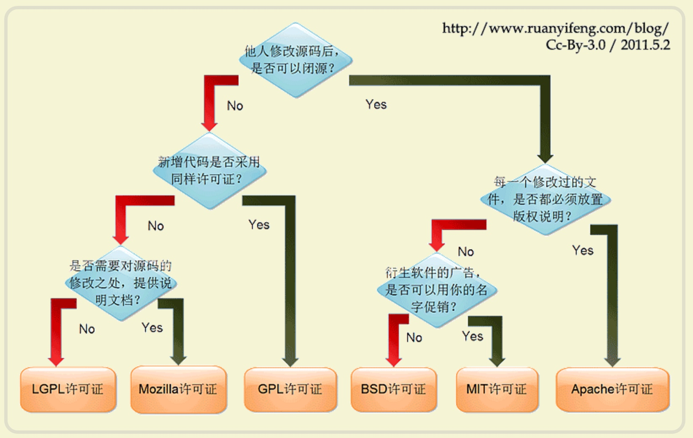

# 开源许可证
## 最常用的六种开源许可证的区别
[GPL](http://www.gnu.org/licenses/gpl.html)、[BSD](https://en.wikipedia.org/wiki/BSD_licenses)、[MIT](https://en.wikipedia.org/wiki/MIT_License)、[Mozilla](https://www.mozilla.org/en-US/MPL/)、[Apache](http://www.apache.org/licenses/LICENSE-2.0)、[LGPL](http://www.gnu.org/copyleft/lesser.html)，
乌克兰程序员Paul Bagwell，画了一张分析图，说明应该怎么选择。这是我见过的最简单的讲解，只用两分钟，你就能搞清楚这六种许可证之间的最大区别

##参考文档
<http://www.ruanyifeng.com/blog/2011/05/how_to_choose_free_software_licenses.html>

